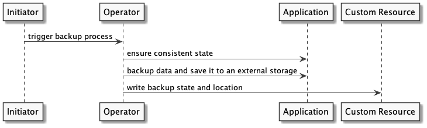

### Operator capabilities
An operator can assist with operating an application or other managed components by solving many different tasks. When talking about operators, the first and most well-known capability is the ability to install and upgrading stateful applications. However, an operator could manage the full lifecycle of an application without necessarily having to deal with the installation/upgrading at all.

The following sections should give an overview of capabilities an operator could have and what a user can expect if an operator implements these capabilities.

#### Install an application / take ownership of an application
An operator should be able to do the following:

* Provision and set up all the required resources, so no manual work is required during the installation. An operator must check and verify that resources that were provisioned are working as expected and ready to be used.
* Recognize resources that were provisioned before the installation process and only take ownership of them for later use. In this case, the ownership process should be seamless and not cause downtime. The goal of the ownership process is to enable easy migration of resources to the operator.
* Report the version of the resources and their health status during the process.

#### Upgrade an application
Under its application upgrading capabilities, an operator should:

* Be able to upgrade the version of the application and resources. The Operator should know how to update the required dependencies and run custom commands, for example, a database migration.
* Monitor the update, and roll back if there was a problem during the process.
* Report the version of the resources and their health status during the process. If there is an error, the version reported should be the version that is currently being used.

#### Backup

This capability is for operators that manage data and ensure that the operator can create consistent backups. These backups should be done in a way that enables the operator to perform a data restore if data is lost or compromised. Furthermore, the status information provided should give insights about when the backup last ran and where it is located.

The above illustration shows how such a process could look.

1. A human or a time scheduling tool (e.g. time-trigger) initiates the backup.
2. The Operator instructs its watched resource (application) to set up a consistent state (like a consistent snapshot).
3. The Operator backs up the application data to external storage using appropriate tools. This could either be a one-step process (backup directly to external storage) or in multiple steps, such as writing to a persistent volume first and the external storage afterwards. The external storage might be an on-premises network file system), but could also an object store in a cloud provider’s infrastructure.
4. The Operator writes the backup’s state (failed or succeed), location of the backup and the application version to the status section of the custom resource.

#### Recovery from backup
The recovery capability of an operator assists a user in restoring the application state from a successful backup. Therefore, the application state (application version and data) should be restored.

Among common use cases:

* Availability of application state and configuration after failure.
    * The user only needs to create a custom resource for the application and specify the backup information. The operator would read the configuration, restore the application version and restore the data.
* The user backed up the data only.
    * They might need to specify the application version used directly in the custom resource that the operator is watching.

In both scenarios, the operator ensures that the application is up and running by reconciling the data from the backup specified with the current application state.

#### Auto-Remediation
The auto-remediation capability of an operator ensures that it is able to restore the application from a more complex failed state, which might not be handled or detected by mechanisms as health checks (live and readiness probes). Therefore, the operator needs to have a deep understanding of the application. This can be achieved by metrics that indicate application failures or errors, but also by dealing with Kubernetes mechanisms like health checks. 

Some examples might be:
* Rolling back to the last known configuration if a defined amount of container starts is unsuccessful after a version change.
* In some points a restart of the application might be a short-term solution which also could be done by the operator.
* It could also be imaginable that an operator informs another operator of a dependent service that a backend system is not reachable at the moment (to take remediation actions).

This capability enables the operator to take actions to keep the system up and running. 

#### Monitoring/Metrics - Observability
While the managed application should provide the telemetry data for itself, the operator can provide metrics about its own behaviour while only providing a high-level overview of the applications state (supporting auto-remediation). Typical telemetry data provided by the operator could be:
* The count of remediation actions.
* Duration of backups.
* Information about the last errors or operational tasks which were handled.

#### Scaling (Operator Supports Scaling)
Scaling is part of the day-2 operations that an operator can manage to keep the application/resources functional. The scaling capability doesn’t require the scaling to be automated, but only inform the operator on how to change the resources in terms of horizontal and vertical scaling.

An operator should be able to increase or decrease any resource that it owns, such as CPU, memory, disk size and the number of instances.

Ideally, the scaling action will happen without downtime. The scaling action ends when all the resources are in a consistent state and ready to be used. Therefore an operator should verify the state of all the resources and report it.

#### Auto-Scaling
An operator should be able to perform the scaling capability based on continuous metric collection and thresholds. An operator should be able to automatically adjust the properties (upwards and downwards) of every resource that it owns.

An operator should respect the basic scaling configuration of min and max.

#### Auto-configuration tuning
This capability empowers the operator to manage the configuration of the managed application.

As an example, an operator can adopt the memory and DNS settings of an application according to the operation environment (e.g. Kubernetes). The operator should also handle these setting changes seamlessly, e.g. if a configuration change requires a restart, the operator must trigger it.

These capabilities should be transparent to the users. The user should be able to override such auto-configuration mechanisms if they want to do so. Besides, automatic reconfigurations should be well-documented and reported in a way that the user can comprehend what is happening within the infrastructure.

#### Uninstalling/Disconnect
When deleting the declaratively requested state (in most cases a custom resource), an operator should allow two behaviours:
* Uninstalling: An operator should be able to completely remove or delete every managed resource.  
* Disconnecting: An operator should stop managing the provisioned resources.

Both processes should be applied to every resource that the operator directly provisioned.    
An operator should report any failure in the process in a declarative way (using the [status field](https://kubernetes.io/docs/concepts/overview/working-with-objects/kubernetes-objects/#object-spec-and-status) for example). 
