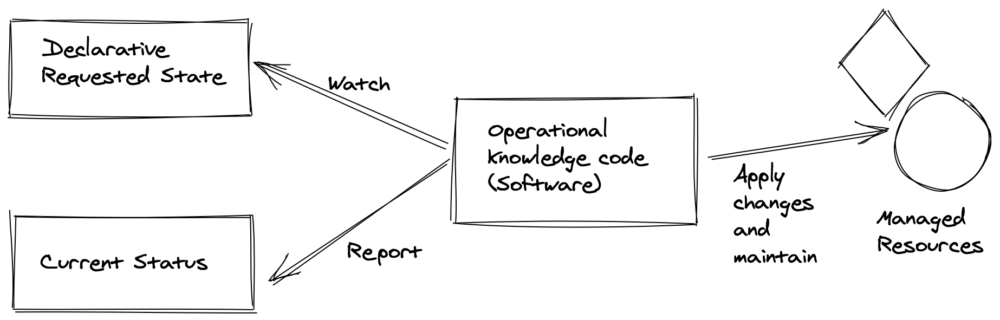
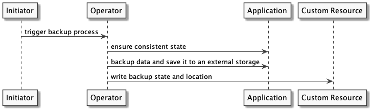

# CNCF Operator White Paper - Final Version

Table of Contents
=================

* [Table of Contents](#table-of-contents)
    * [Executive Summary](#executive-summary)
    * [Introduction](#introduction)
        * [The Goal of this document](#the-goal-of-this-document)
        * [Target Audience / Minimum Level of Experience](#target-audience--minimum-level-of-experience)
    * [Foundation](#foundation)
        * [Operator Design Pattern](#operator-design-pattern)
        * [Operator Characteristics](#operator-characteristics)
        * [Operator Components in Kubernetes](#operator-components-in-kubernetes)
        * [Operator Capabilities](#operator-capabilities)
    * [Security](#security)
        * [Operator Developer](#operator-developer)
        * [Application Developer (Operator\-"Users")](#application-developer-operator-users)
    * [Operator Frameworks for Kubernetes](#operator-frameworks-for-kubernetes)
        * [CNCF Operator Framework](#cncf-operator-framework)
        * [Kopf](#kopf)
        * [kubebuilder](#kubebuilder)
        * [Metacontroller \- Lightweight Kubernetes Controllers as a Service](#metacontroller---lightweight-kubernetes-controllers-as-a-service)
    * [Operator Lifecycle Management](#operator-lifecycle-management)
        * [Upgrading the Operator](#upgrading-the-operator)
        * [Upgrading the Declarative State](#upgrading-the-declarative-state)
        * [Managing Relations of CRDs](#managing-relations-of-crds)
    * [Use Cases for an Operator](#use-cases-for-an-operator)
        * [Prometheus Operator](#prometheus-operator)
        * [Operator for GitOps](#operator-for-gitops)
    * [Successful Patterns](#successful-patterns)
        * [Management of a single type of application](#management-of-a-single-type-of-application)
        * [Operator of Operators](#operator-of-operators)
        * [One CRD per Controller](#one-crd-per-controller)
        * [Where to publish and find Operators](#where-to-publish-and-find-operators)
        * [Further reading](#further-reading)
    * [Designing Operators](#designing-operators)
        * [Requirement Analysis](#requirement-analysis)
        * [Custom or third\-party Operator](#custom-or-third-party-operator)
        * [Use the right Tool](#use-the-right-tool)
        * [Use the right programming language](#use-the-right-programming-language)
        * [Design your Operator according to your needs](#design-your-operator-the-according-to-your-needs)
        * [References](#references)
    * [Emerging Patterns of the Future](#emerging-patterns-of-the-future)
        * [Operator Lifecycle Management](#operator-lifecycle-management-1)
        * [Policy\-Aware Operators](#policy-aware-operators)
        * [References](#references-1)
    * [Conclusion](#conclusion)
    * [Related Work](#related-work)
    * [Acknowledgements](#acknowledgements)
        * [Contributors](#contributors)
        * [Reviewers](#reviewers)

## Executive Summary
Maintaining application infrastructure requires many repetitive human activities that are devoid of lasting value.
Computers are the preferred method of performing precise tasks, verifying the state of an object and therefore enabling the infrastructure requirements to be codified. An operator provides a way to encapsulate the required activities, checks and state management of an application.

In Kubernetes, an operator provides intelligent, dynamic management capabilities by extending the functionality of the API.

These operator components allow for the automation of common processes as well as reactive applications that can continually adapt to their environment. This in turn, allows for more rapid development with fewer errors, lower mean-time-to-recovery, and increased engineering autonomy.

Given the rising popularity of the operator pattern, it has become incumbent for there to be a reference paper that helps both novice and expert alike to learn from the community endorsed best practices for achieving their goals.
In this document, we outline not only the taxonomy of an operator but the recommended configuration, implementation and use cases for an operator application management system.

## Introduction

This whitepaper defines operators in a wider context than Kubernetes. It describes their characteristics and components, gives an overview of common patterns currently in use and explains how they differ from Kubernetes controllers.

Additionally, it provides a deep dive into the capabilities of Kubernetes controllers, including backup, recovery and automatic configuration tuning. Further insights into frameworks currently in use, lifecycle management, security risks and use cases are provided.

This paper includes best practices including observability, security and technical implementation.

It closes with related work, highlights the additional value they can bring beyond this whitepaper and the next steps for operators.

### The Goal of this Document
The goal of this document is to provide a definition of operators for cloud native applications in the context of Kubernetes and other container orchestrators.


### Target Audience / Minimum Level of Experience
This document is intended for application developers, Kubernetes cluster operators and service providers (internal or external) - who want to learn about operators and the problems they can solve. It can also help teams already looking at operators to learn when and where to use them to best effect. It presumes basic Kubernetes knowledge such as familiarity with Pods and Deployments.

## Foundation
Kubernetes and the success of other orchestrators has been due to their focus on the main capabilities of containers.
While companies began their journey to cloud native, working with more specific use cases (microservices, stateless applications) made more sense.
As Kubernetes and other container orchestrators grew their reputation and extensibility, requirements became more ambitious.
The desire to use the full lifecycle capabilities of an orchestrator was also transferred to highly distributed data stores.

Kubernetes primitives were not built to manage state by default.
Relying on Kubernetes primitives alone brings difficulty managing stateful application requirements such as replication, failover automation, backup/restore and upgrades (_which can occur based on events that are too specific_).

The Operator Pattern can be used to solve the problem of managing state.
By leveraging Kubernetes built-in capabilities such as self-healing, reconciliation and extending those along with application-specific complexities; it is possible to automate any application lifecycle, operations and turn it into a highly capable offering.

Operators are thought of as synonymous with Kubernetes.
However, the idea of an application whose management is entirely automated can be exported to other platforms.
The aim of this paper is to bring this concept to a higher level than Kubernetes itself.

### Operator Design Pattern
This section describes the pattern with high-level concepts.
The next section _Kubernetes Operator Definition_ will describe the implementations of the pattern in terms of Kubernetes objects and concepts.

The operator design pattern defines how to manage application and infrastructure resources using domain-specific knowledge and declarative state. The goal of the pattern is to reduce the amount of manual imperative work (how to backup, scale, upgrade...) which is required to keep an application in a healthy and well-maintained state, by capturing that domain specific knowledge in code and exposing it using a declarative API.

By using the operator pattern, the knowledge on how to adjust and maintain a resource is captured in code and often within a single service (also called a controller).

When using an operator design pattern the user should only be required to describe the desired state of the application and resources. The operator implementation should make the necessary changes in the world so it will be in the desired state. The operator will also monitor the real state continuously and take actions to keep it healthy and in the same state (preventing drifts).

A general diagram of an operator will have software that can read the desired spec and can create and manage the resources that were described.



The Operator pattern consists of three components:

* The application or infrastructure that we want to manage.
* A domain specific language that enables the user to specify the desired state of the application in a declarative way.
* A controller that runs continuously:
    * Reads and is aware of the state.
    * Runs actions when operations state changes in an automated way.
    * Report the state of the application in a declarative way.

This design pattern will be applied on Kubernetes and its operators in the next sections.

### Operator Characteristics
The core purpose of any operator is to extend its orchestrator's underlying API with new domain knowledge. As an example, an orchestration platform within Kubernetes natively understands things like containers and layer 4 load balancers via the Pod and Service objects. An operator adds new capabilities for more complex systems and applications. For instance, a prometheus-operator introduces new object types _Prometheus_, extending Kubernetes with high-level support for deploying and running Prometheus servers.

The capabilities provided by an operator can be sorted into three overarching categories: dynamic configuration, operational automation and domain knowledge.

#### Dynamic Configuration
Since the early stages of software development, there have been two main ways to configure software: configuration files and environment variables. The cloud native world created newer processes, which are based on querying a well-known API at startup. Most existing software relies on a combination of both of these options. Kubernetes naturally provides many tools to enable custom configuration (such as ConfigMaps and Secrets). Since most Kubernetes resources are generic, they don’t understand any specifics for modifying a given application. In comparison, an operator can define new custom object types (custom resources) to better express the configuration of a particular application in a Kubernetes context.

Allowing for better validation and data structuring reduces the likelihood of small configuration errors and improves the ability of teams to self-serve. This removes the requirement for every team to house the understanding of either the underlying orchestrator or the target application as would be traditionally required. This can include things like progressive defaults, where a few high-level settings are used to populate a best-practices-driven configuration file or adaptive configuration such as adjusting resource usage to match available hardware or expected load based on cluster size.

#### Operational Automation
Along with custom resources, most operators include at least one custom controller. These controllers are daemons that run inside the orchestrator like any other but connect to the underlying API and provide automation of common or repetitive tasks. This is the same way that orchestrators (like Kubernetes) are implemented. You may have seen kube-controller-manager or cloud-controller-manager mentioned in your journey so far. However, as was demonstrated with configuration, operators can extend and enhance orchestrators with higher-level automation such as deploying clustered software, providing automated backups and restores, or dynamic scaling based on load.

By putting these common operational tasks into code, it can be ensured they will be repeatable, testable and upgradable in a standardized fashion. Keeping humans out of the loop on frequent tasks also ensures that steps won’t be missed or excluded and that different pieces of the task can’t drift out of sync with each other. As before, this allows for improved team autonomy by reducing the hours spent on boring-but-important upkeep tasks like application backups.

#### Domain Knowledge
Similar to operational automation, it can be written into an operator to encode specialized domain knowledge about particular software or processes. A common example of this is application upgrades. While a simple stateless application might need nothing more than a Deployment’s rolling upgrade; databases and other stateful applications often require very specific steps in sequence to safely perform upgrades. The operator can handle this autonomously as it knows your current and requested versions and can run specialized upgrade code when needed. More generally, this can apply to anything a pre-cloud-native environment would use manual checklists for (effectively using the operator as an executable runbook).
Another common way to take advantage of automated domain knowledge is error remediation. For example, the Kubernetes built-in remediation behaviors mostly start and end with “restart container until it works” which is a powerful solution but often not the best or fastest solution.
An operator can monitor its application and react to errors with specific behavior to resolve the error or escalate the issue if it can’t be automatically resolved. This can reduce MTTR (mean time to recovery) and also reduce operator fatigue from recurring issues.

### Operator Components in Kubernetes

*“An operator is a Kubernetes controller that understands 2 domains: Kubernetes and something else. By combining knowledge of both domains, it can automate tasks that usually require a human operator that understands both domains”*
(Jimmy Zelinskie, https://github.com/kubeflow/tf-operator/issues/300#issuecomment-357527937)


Operators enable the extension of the Kubernetes API with operational knowledge.
This is achieved by combining Kubernetes controllers and watched objects that describe the desired state. The controller can watch one or more objects and the objects can be either Kubernetes primitives such as Deployments, Services or things that reside outside of the cluster such as Virtual Machines or Databases.

The desired state refers hereby to any resource that is defined in code and which the operator is configured to manage. Subsequently, the current state references the deployed instance of those resources.

The controller will constantly compare the desired state with the current state using the reconciliation loop which ensures that the watched objects get transitioned to the desired state in a defined way.

The desired state is encapsulated in one or more Kubernetes custom resources and the controller contains the operational knowledge which is needed to get the objects (such as deployments, services) to their target state.

#### Kubernetes Controllers
A Kubernetes Controller takes care of routine tasks to ensure the desired state expressed by a particular resource type matches the current state (current state,https://engineering.bitnami.com/articles/a-deep-dive-into-kubernetes-controllers.html, https://fntlnz.wtf/post/what-i-learnt-about-kubernetes-controller/). For instance, the Deployment controller takes care that the desired amount of pod replicas is running and a new pod spins up, when one pod is deleted or fails.

Technically, there is no difference between a typical controller and an operator. Often the difference referred to is the operational knowledge that is included in the operator. Therefore, a controller is the implementation, and the operator is the pattern of using custom controllers with CRDs and automation is what is looking to be achieved with this. As a result, a controller which spins up a pod when a custom resource is created, and the pod gets destroyed afterwards can be described as a simple controller. If the controller has operational knowledge like how to upgrade or remediate from errors, it is an operator.

#### Custom Resources and Custom Resource Definitions
Custom resources are used to store and retrieve structured data in Kubernetes as an extension of the default Kubernetes API  (https://kubernetes.io/docs/concepts/extend-kubernetes/api-extension/custom-resources/).
In the case of an operator, a custom resource contains the desired state of the resource (e.g. application) but does not contain the implementation logic. Such information could be the version information of application components, but also enabled features of an application or information where backups of the application could be part of this. A custom resource definition (CRD) defines how such an object looks like, for example, which fields exist and how the CRD is named. Such a CRD can be scaffolded using tools (as the operator SDK) or be written by hand.


The following example illustrates, how such an custom resource instance definition could look like:

```yaml
apiVersion: example-app.appdelivery.cncf.io/v1alpha1
kind: ExampleApp
metadata:
  name: appdelivery-example-app
spec:
  appVersion: 0.0.1
  features:
    exampleFeature1: true
    exampleFeature2: false
  backup:
    enabled: true
    storageType: “s3”
    host: “my-backup.example.com”
    bucketName: “example-backup”
  status:
    currentVersion: 0.0.1
    url: https://myloadbalancer/exampleapp/
    authSecretName: appdelivery-example-app-auth
    backup:
      lastBackupTime: 12:00
```

This example represents a custom resource with the name “appdelivery-example-app” of the kind “ExampleApp”.

The “spec” section is where the user can declare the desired state. This example declares that appVersion 0.0.1 should be deployed with one feature enabled and another disabled. Furthermore, backups of this application should be made, and a s3 bucket should be used.

The “status” section is where the operator can communicate useful information back to the user. In this example, the status shows the current deployed version. If it is different from the “appVersion” in the spec, then the user can expect that the operator is working to deploy the version requested in the spec. Other common information in the status section includes how to connect to an application and the health of the application.

#### Control Loop
The control (reconciliation) loop in a Kubernetes controller ensures that the state that the user declares using a CRD matches the state of the application, but also that the transition between the states works as intended. One common use-case could be the migration of database schemes when upgrading an application. The control loop can be triggered on specific events, as a change on the crd, but also time-based, like for backing up data at a defined time.

### Operator Capabilities
An operator is able to assist with operating an application or other managed components by solving many different tasks. When talking about operators, the first and most well known capability is the ability of installing and upgrading stateful applications. However, an operator could manage the full lifecycle of an application without requiring manual input on installation/upgrades.

The following sections should give an overview about capabilities an operator could have and what a user can expect if an operator implements these capabilities.

#### Install an Application / Take Ownership of an Application
An operator should be able to provision and set up all the required resources, so no manual work would be required during the installation. An operator must check and verify that resources that were provisioned are working as expected, and ready to be used.

An operator should also be able to recognize resources that were provisioned before the installation process, and only take ownership of them for later use. In this case, the ownership process should be seamless and not cause downtime. The ownership process purpose is to enable easy migration of resources to the operator.

An Operator should report the version of the resources and their health status during the process.

#### Upgrade an Application
An operator should be able to upgrade the version of the application/resources. The operator should know how to update the required dependencies and execute custom commands such as running a database migration.

An operator should monitor the update and rollback if there was a problem during the process.

An operator should report the version of the resources and their health status during the process. If there was an error, the version reported should be the version that is currently being used.

#### Backup

This capability is for operators that manage data and ensure that the operator is able to create consistent backups. This backup should be done in a way that the user of the operator can be certain that the previous version can be restored if data is lost or compromised. Furthermore, the status information provided should give insights about when the backup last ran and where it is located.



The above illustration shows how such a process could look like. At first, the backup gets triggered either by a human or another trigger (e.g. time-trigger). The operator instructs its watched resource (application) to set up a consistent state (like a consistent snapshot). Afterwards, the data of the application gets backed up to external storage using appropriate tools. This could either be a one-step process (backup directly to external storage) or in multiple steps, like writing to a persistent volume at first and to the external storage afterwards. The external storage might be an NFS/CIFS share (or any other network file system) on-premises, but also an object store/bucket on a cloud provider infrastructure. Whether the backup failed or succeeded, the state (of the backup) including the backed-up application version and the location of the backup might be written to the status section of the custom resource.

#### Recovery from backup

The recovery capability of an operator might assist a user in restoring the application state from a successful backup. Therefore, the application state (application version and data) should be restored.

There might be many ways to achieve this. One possible way could be that the current application state also gets backed up (including configuration), so the user only has to create a custom resource for the application and point to the backup. The operator would read the configuration, restore the application version and restore the data. Another possible solution might be that the user only backed up the data and might have to specify the application version used. Nevertheless, in both ways, the operator ensures that the application is up and running after using the data from the backup specified.

#### Auto-Remediation
The auto-remediation capability of an operator should ensure that it is able to restore the application from a more complex failed state, which might not be handled or detected by mechanisms such as health checks (live and readiness probes). Therefore, the operator needs to have a deep understanding of the application. This can be achieved by metrics that might indicate application failures or errors, but also by dealing with kubernetes mechanisms like health checks.

Some examples might be:
* Rolling back to the last known configuration if a defined amount of pod starts is unsuccessful after a version change.
  In some points a restart of the application might be a short-term solution which also could be done by the operator.
* It could also be imaginable that an operator informs another operator of a dependent service that a backend system is not reachable at the moment (to take remediation actions).

In any situation, this capability enables the operator to take actions to keep the system up and running.


#### Monitoring/Metrics - Observability
While the managed application should provide the telemetry data for itself, the operator could provide metrics about its own behavior and only provide a high level overview about the applications state (as it would be possible for auto-remediation). Furthermore, typical telemetry data provided by the operator could be the count of remediation actions, duration of backups, but also information about the last errors or operational tasks which were handled.


#### Scaling
Scaling is part of the day-2 operations that an operator can manage in order to keep the application / resources functional. The scaling capability doesn’t require the scaling to be automated, but only that the operator will know how to change the resources in terms of horizontal and vertical scaling.

An operator should be able to increase or decrease any resource that it owns, such as CPU, memory, disk size and number of instances.

Ideally the scaling action will be without downtime. Scaling action ends when all the resources are in consistent state and ready to be used, so an operator should verify the state of all the resources and report it.

#### Auto-Scaling
An operator should be able to perform the scaling capability based on metrics that it collects constantly and according to thresholds. An operator should be able to automatically increase and decrease every resource that it’s own.

An operator should respect basic scaling configuration of min and max.


#### Auto-Configuration tuning
This capability should empower the operator to manage the configuration of the managed application. As an example, the operator could adopt memory settings of an application according to the operation environment (e.g. Kubernetes) or the change of DNS names. Furthermore, the operator should be able to handle configuration changes in a seamless way, e.g. if a configuration change requires a restart, this should be triggered.

These capabilities should be transparent to the users. The user should have the possibility to override such auto-configuration mechanisms if they want to do so. Furthermore, automatic reconfigurations should be well-documented in a way that the user could comprehend what is happening on the infrastructure.

#### Uninstalling / Disconnect
When deleting the declarative requested state (in most cases a custom resource), an operator should allow two behaviors:
- Uninstalling: An operator should be able to completely remove or delete every managed resource.
- Disconnecting: An operator should stop managing the provisioned resources.

Both processes should be applied to every resource that the operator directly provisioned.
An operator should report any failure in the process in a declarative way (using the [status field](https://kubernetes.io/docs/concepts/overview/working-with-objects/kubernetes-objects/#object-spec-and-status) for example).

## Security


Operators are intended to manage their state and configuration via the Kubernetes API server using the Custom Resource Definition. The subordinate API resources they manage (often pods running stateful applications) also have their lifecycle and supporting RBAC, services, etc. managed via the Kubernetes API. In some cases, the operator will also interact with the application’s API across the network. All of these routes offer the potential to compromise the operator and its resources and should be protected in line with best practices laid out below.

### Operator Developer
Operator developers should be aware of the security risks an operator
introduces and document its secure use. While developing an operator
it's important to focus on key areas such as transparency and
documentation, operator scope, and vulnerability analysis.

#### Transparency and Documentation
During the development of an operator, a developer should have a clear understanding of how it will work and interface within Kubernetes. As developers shift from development to publishing the operator, users should be provided with a clear understanding of what the operator does, and how.
You've written something you're proud of, but think of this from the end user's point of view: Should they trust source code from the internet, an operator to run with administrative access on their cluster which may be large and costly, or maybe handling sensitive information? Anything the developer can do to help a user get up to speed with their software, how it works, how it's secured, and what effects it might have on their cluster will make it easier for them to adopt the software.

Here are some items that can help users make informed decisions
about if they should use an operator:

* Descriptive diagram (threat model) of how the operator is
  communicating and with what is a good start to helping a user
  understand how they must secure it and apply policy for the operator.
* Use case of how the software is intended to be used in order to
  stay in scope for compliance or you risk vulnerability outside that
  scope.
* Documented RBAC scopes, threat model, communication ports, API
  calls available, pod security policy requisites (or other policy engine
  requisites), or any other policy engine requisites developed for
  Kubernetes such as OPA.
* Security reporting, disclosure, and incident response processes:
  If someone finds a potential security issue, who should they contact
  and what type of response should they expect?
* Logging and monitoring attachment through exposed endpoints, log
  levels, or log aggregation.
* Operator issue, feature, version tracking.
* If the project has had security disclosures in the past, listing
  these disclosures (and their CVE IDs) on a web page is a strong step
  in building trust with users. Everyone will have security
  issues at some point - how they are handled displays the maturity
  of a project.

For further ideas around the security of the development process,
the reader may wish to review the CNCF Security TAG's [self-assessment
questionnaire](https://github.com/cncf/tag-security/blob/main/assessments/guide/self-assessment.md).

#### Operator Scope

There are many use cases for operators and there is virtually no limit
in the scope of what you can design it for. In order to be clear about
the secure nature of an operator there should be clear communication
involved with each scope. The general scope’s which could be used are
cluster-wide operators, namespace operators, and external operators. In
order to best secure them, there needs to be an understanding of the
communication, any API’s created, controllers and their responsibility,
and any application metric endpoints. If this information is provided
with the operator it can be used to further secure the operator
application within the scope of implementation. If the information is
not provided you can be left vulnerable to a myriad of attacks.

**Cluster-wide Operators** exist to execute custom resources across a
cluster no matter if those resources are living in another namespace
or not.
**Namespace Operators** exist to execute custom resources within a
namespace. Usually there are policy engine policies applied to jail the
scope within the namespace and only communicate with pods within the
namespace. This is considered more secure by nature, but the same rules
apply.
**External Operators** exist to execute custom resources that are
external to the cluster. The same rules apply, in addition to secure this
scope we must know the nature of the communication from the cluster to
the external component.

While this paper also discusses scoping from a user point-of-view,
how an operator is designed will weigh heavily on the type of
security controls which can be applied against it in production.
It is common to start with lax permissions, and intentions to apply
security concepts before release; Spending some time thinking about
the security design of the operator as developers begin work on it
will make this process much easier for developers and their users.

#### Vulnerability Analysis

Being focused on the development and security of the operator,
there are steps that must be taken as an operator developer to ensure
validation and proper security analysis has been done. Following the
guidelines in the CNCF Cloud Native Security Whitepaper there is a
clear lifecycle process which defines the [layers of concern](https://github.com/cncf/tag-security/blob/main/security-whitepaper/v2/cloud-native-security-whitepaper.md#cloud-native-layers) for the operator developer. All three layers
should be adhered to with a strict focus on the develop and distribute
layers in the scope of the operator developer. There are many detailed
guidelines in the development and distribution layers that will help
to apply sound vulnerability analysis to supply chain to ensure
that the operator being developed is signed and trusted for the best
integrity. The CNCF [Cloud Native Security Whitepaper](https://github.com/cncf/tag-security/blob/main/security-whitepaper/v2/cloud-native-security-whitepaper.md)
is available at this link.

In addition to the supply chain there needs to be a focus on
performing a threat model of the operator to keep the developer
in check and also make sure that there was nothing incidentally missed
that could leave the door open for attack. The foundational model for
checking for threats can be observed in the CNCF Cloud Native Security
Whitepaper on [Threat Modeling](https://github.com/cncf/tag-security/blob/main/security-whitepaper/v2/cloud-native-security-whitepaper.md#threat-modeling).

### Application Developer (Operator-"Users")

Operators perform administrative tasks on the user’s behalf such
as volume creation/attachment, application deployment, and
certificate management. As the user is delegating control to the
operator, it is essential to provide machine authorization to perform
the actions needed, but one must also be careful to not grant more
privileges than necessary for the operator to perform its role.

Deployment of an operator grants third-party software some level
of access to a Kubernetes namespace or cluster. While security
expertise is not required to use operators, the following  Kubernetes
concepts highlight security preparation when using an operator:

**Namespaces** are one of the primary ways of grouping and cordoning a
group of resources. In regards to an operator, the user should
consider what namespaces the operator needs to work with. While
there may be some use cases where a single operator needs access
to the whole cluster, it seems the common use case in 2021 is for
an operator to work with a specific application within Kubernetes,
so it usually makes sense to provide a namespace for that application
and related resources/operators. To further reduce the operator’s
separation from any loose or stolen RBAC in the subordinate resource’s
namespace, a dedicated namespace for the operator provides more
separation.

**Role-Based Access Controls** are available in modern releases of
Kubernetes. When granting an operator access to resources, the focus
should be on granting the most limited set of permissions needed
for the operator to perform its task. This means only grant
ClusterRoles if absolutely necessary, but granting specific permissions
for specific resources/namespaces. The
[Using RBAC Authorization](https://kubernetes.io/docs/reference/access-authn-authz/rbac/)
chapter of the user guide covers this topic in detail. Operator
build kits such as the Operator SDK use general RBAC defaults that
developers may have not refined for their specific operator.
Permissions afforded by the service account identity outside the
cluster include federated and cross-cluster operators that have
permissions in other Kubernetes clusters. As operators are increasingly
used to manage off-cluster and cloud resources, cloud IAM integration
permissions should be configured to prevent cloud account takeover
from a compromised operator.

_One thing to note_: A “land grab” of privileges - e.g requesting
significant/administrative access - is not always malicious in
intent. The developer might not know better or have had the time
to tune the required permissions to the concept of least privilege.
Even in the most innocent case, though, it is still a red flag:
Perhaps the operator has reached enough adoption for others to find and
raise concerns about the overuse of privileges, and perhaps it is a
sign of other security weaknesses within the operator. It is advisable
to proceed with caution if such a “land grab” is found.

**Software provenance**: The “software supply chain” is starting to get
more attention at the time of writing this whitepaper. Consider the
source for an operator, how it is being installed, and how or why
a malicious user may want access to a kubernetes cluster. Spend a few minutes
reviewing an installation script before running it. While the kubectl
command supports the ability to apply a yaml script directly from
the public Internet (e.g `kubectl create -f
https://publicwebsite.com/install/operator.yaml`) it is strongly
recommended that one first downloads that file locally, review it,
and then run `kubectl create -f operator.yaml`.

To review the script ask the following questions:

* What is the purpose of this script?
* What resources are being created by the script? Is this script creating Roles and RoleBindings?
* What 3rd party sources will the script attempt to use? (e.g.
  container images, other yaml files) How popular and well-maintained
  are the git and docker image repositories? These might be signs of
  a new project, abandoned software which is no longer receiving
  security updates, or indicators of an unofficial repository with
  malicious intent.
* What privileges does the script attempt to gain? Does the script
  attempt to run container securityContexts with host sharing or
  “privileged mode”?

More information about software supply chain security is available in the [CNCF Supply Chain Security White Paper](https://github.com/cncf/tag-security/tree/main/supply-chain-security/supply-chain-security-paper).

**Advanced security controls**, such as SELinux, AppArmor, or seccomp
may be mandated by cluster policy. Open source operators are unlikely
to have configurations for these Linux security modules, but if
an organization is familiar with one of these control systems,
writing the appropriate security configuration for the operator
should not require significant overhead.

**Operator configuration**: Ideally a project will be “secure by default” to increase the likelihood of a secure operator or application deployment. Insecure defaults require manual configuration to secure the environment. While it may seem like unnecessary work to learn the configuration parameters of a new operator, it is usually preferable to manually adjusting the configuration and/or source code of an operator itself to reach the needed level of security.

## Operator Frameworks for Kubernetes
Currently, many frameworks exist to simplify the process of bootstrapping an operator/controller project and to write operators. This chapter describes some of them without any claim to comprehensiveness.

### CNCF Operator Framework

The *[Operator Framework](https://github.com/operator-framework)* is an open source toolkit to manage Kubernetes native applications, called Operators, in an effective, automated, and scalable way.

It aims at Operator Developers with an SDK to streamline Operator development with scaffolding tools (based on [kubebuilder](https://github.com/kubernetes-sigs/kubebuilder)), a test harness for unit tests and integration as well as functional tests and packaging / distribution mechanisms to publish version histories of Operators in conjunction with a user-configurable update graph. Supported project types are Golang, Helm and Ansible. Python and Java are currently in development.

It also caters for Kubernetes administrators that require a central point to install, configure and update Operators in a multi-tenant environment with potentially dozens of Operators installed. It covers the following aspects of Operator lifecycle:

- Continuous over-the-Air Updates and Catalogs of Operators as a publishing mechanism and source of updates
- Dependency Model so Operator can have dependencies on cluster features or on each other
- Discoverability for less privileged tenants that usually cannot list CRDs or see Operators installed in separate namespaces
- Cluster Stability that avoid runtime conflicts of Operators on multi-tenant clusters while honoring the global nature of CRDs, and the subtleties of CRD versioning and CRD conversion
- Declarative UI controls that allows consoles to generate rich UI experiences for end users interacting with Operator services

### Kopf

**[Kopf](https://github.com/nolar/kopf)** —**K**ubernetes **O**perator **P**ythonic **F**ramework— is a framework
to create Kubernetes operators faster and easier, just in a few lines of Python.
It takes away most of the low-level Kubernetes API communication hassle and
marshalls the Kubernetes resource changes to Python functions and back:

```python
import kopf

@kopf.on.create(kind='KopfExample')
def created(patch, spec, **_):
    patch.status['name'] = spec.get('name', 'world')

@kopf.on.event(kind='KopfExample', field='status.name', value=kopf.PRESENT)
def touched(memo, status, **_):
    memo.last_name = status['name']

@kopf.timer('KopfExample', interval=5, when=lambda memo, **_: 'last_name' in memo)
def greet_regularly(memo, **_):
    print(f"Hello, {memo['last_name']}!")
```

You should consider using this framework if you want or need to make ad-hoc
(here-and-now one-time non-generalizable) operators in Python 3.7+; especially if you want to bring your application domain directly to Kubernetes as custom
resources.
For more features, see the [documentation](https://kopf.readthedocs.io/en/stable/).

### kubebuilder

The kubebuilder framework provides developers the possibilities to extend the Kubernetes API by using Custom Resource Definitions, and to create controllers that handle these custom resources.

The main entry point provided by the kubebuilder framework is a *Manager*. In the same way the native Kubernetes controllers are grouped into a single Kubernetes Controller Manager (`kube-controller-manager`), you will be able to create several controllers and make them managed by a single manager.

As Kubernetes API resources are attached to domains and arranged in Groups, Versions and Kinds, the Kubernetes custom resources you will define will be attached to your own domain, and arranged in your own groups, versions and kinds.

The first step when using kubebuilder is to create a project attached to your domain, that  will create the source code for building a single Manager.

After initiating your project with a specific domain, you can add APIs to your domain and make these APIs managed by the manager.

Adding a resource to the project will generate some sample code for you: a sample *Custom Resource Definition* that you will adapt to build your own custom resource, and a sample *Reconciler* that will implement the reconcile loop for your operator handling this resource.

The kubebuilder framework leverages the `controller-runtime` library, that provides the Manager and Reconciler concepts, among others.

The kubebuilder framework provides all the requisites for building the manager binary, the image of a container starting the manager, and the Kubernetes resources necessary for deploying this manager, including the `CustomResourceDefinition` resource defining your custom resource, a `Deployment` to deploy the manager, and RBAC rules for your operator to be able to access the Kubernetes API.

### Metacontroller - Lightweight Kubernetes Controllers as a Service

[Metacontroller](https://metacontroller.github.io/metacontroller/) is an operator, that makes it easy to write and deploy custom operators.

It introduces two CRD's itself (2021) :
* [Composite Controller](https://metacontroller.github.io/metacontroller/api/compositecontroller.html) - allowing to write operator triggered by CRD
* [Decorator Controller](https://metacontroller.github.io/metacontroller/api/decoratorcontroller.html) - allowing to write operator triggered by any kubernetes object (also managed by other operators)

Metacontrollers itself, configured by one of its CRD, will take care of observing cluster state and call controller, provided by user(user controller), to take actions.

User controller should, having given resources as input, compute the desired state of dependent objects.

This could also be called `lambda controller` pattern (more on this [here](https://metacontroller.github.io/metacontroller/concepts.html#lambda-controller)), as the output is calculated only considering input and the logic used by metacontroller could also reside at a Function-as-a-Service provider.

Main advantages of metacontroller :
* Only a function (called via webhook) without any boilerplate related to watching kubernetes resources needs to be provided
* Such a function can be written in any language, and exposed via http

Main limitations :
* Only certain patterns are possible to implement, mentioned above
* The current architecture relies on a single metacontroller in a cluster
* Metacontroller is not aware of any external state, it relies entirely on cluster state

Example metacontroller configuration, shown below, is used to add additional network exposure for `StatefulSet` without explicitly defining `Service` manifest.
```yaml
apiVersion: metacontroller.k8s.io/v1alpha1
kind: DecoratorController
metadata:
  name: service-per-pod
spec:
  resources:
  - apiVersion: apps/v1
    resource: statefulsets
    annotationSelector:
      matchExpressions:
      - {key: service, operator: Exists}
      - {key: port, operator: Exists}
  attachments:
  - apiVersion: v1
    resource: services
  hooks:
    sync:
      webhook:
        url: http://service-per-pod.metacontroller/sync-service-per-pod
        timeout: 10s

```
With above configuration :
* `metacontroller`, for every object matching `spec.resources` description (in this case - `apps/v1/statefulsets` with `service` and `port` annotations), will watch for any change in matching objects (create/update/delete) and invoke `hooks.sync` on each of those
* the `hooks.sync` can return objects which are described in `spec.attachments` (in this case - `v1/services`) which will be created/updated/deleted by `metacontroller`, according to `hook` response
  For example, if below `StatefulSet` will be deployed:
```yaml
apiVersion: apps/v1
kind: StatefulSet
metadata:
  annotations:
    service: "statefulset.kubernetes.io/pod-name"
    ports: "80:8080"
...
```
given `Service` object will be created by metacontroller:
```yaml
apiVersion: "v1"
kind: "Service"
spec:
  selector: "statefulset.kubernetes.io/pod-name"
  ports:
  - port: 80
    targetPort: 8080
```

The user defined endpoint (in this example - `http://service-per-pod.metacontroller/sync-service-per-pod`) only needs to care about the calculation of the `Service` and how it should look like for a given `StatefulSet`.

Additional examples and ideas that could be implemented using metacontroller, can be found at the [metacontroller-examples](https://metacontroller.github.io/metacontroller/examples.html) page !

For any question, please visit our slack channel ([#metacontroller](https://kubernetes.slack.com/archives/CA0SUPUDP)) or ask it on [github discussions](https://github.com/metacontroller/metacontroller/discussions/).

## Operator Lifecycle Management
An operator is an application, this section will describe considerations regarding the lifecycle of the operator itself.

### Upgrading the Operator
While upgrading the operator, special care should be taken in regards to the managed resources. During an operator upgrade, the managed resources should be kept in the same state and healthy.

### Upgrading the Declarative State
The declarative state is the API of the operator, and it may need to be upgraded. The usage of CRD versions indicates the stability of the CRD and the operator - [read more about versioning a CRD](https://kubernetes.io/docs/tasks/extend-kubernetes/custom-resources/custom-resource-definition-versioning/)

### Managing Relations of CRDs

As the number of Operators & CRDs adds up, its complexity of management also increases. For example, how to manage the conflicts between Operators, like two ingress-related functions? How to manage the dependencies and/or correlation of data flow between CRDs, like DB cluster and DB backup CRDs?

To resolve this problem, we would need a concrete model to manage Operators & CRDs and
a new mechanism to oversee them with a policy-based engine.
Community efforts like [KubeVela](https://kubevela.io/) and [Crossplane](https://crossplane.io/)
have been trying to solve this problem by providing solutions to compose CRDs.
KubeVela also provides management of data dependencies between custom resources.

## Use Cases for an Operator
Example:
An operator is used to install an application, or to provision another object which is achieved by defining a set of objects which are managed by the operator and how they work with each other. After the installation, the target application should be running without human interaction. In further consequence, a controller is used for the reconfiguration of a system.

To achieve this, an operator watches the current state and the definitions made in the custom resource or external events. Comparing them and starting to reconcile the application to get to the desired state when it is needed. Changes in the custom resource could be enabling a feature or changing a version, external events could be the availability of an application update reported by an API. The current state of the application could also differ when objects managed by the operator get deleted and so they also get recreated to get to the desired state.

When updating an application, the operator contains the logic which is needed to get to the new application version and how to transition. As described in the last chapter, these could be mechanisms to backup data before updating the database schema. Therefore, the logic included in the operator knows which prerequisites are necessary to build a consistent backup, how to backup the data and how to get back to the normal state.

Finally, the operator is able to remove the application and the resulting objects.


### Prometheus Operator

The Prometheus Operator was one of the first ever Operators written, along with etcd, that proved the use case for this problem space.

_"The Prometheus Operator serves to make running Prometheus on top of Kubernetes as easy as possible, while preserving Kubernetes-native configuration options."_

When the [Prometheus Operator](https://github.com/prometheus-operator/prometheus-operator/blob/master/Documentation/user-guides/getting-started.md) is installed, besides the operator controller pod/deployment, a wide range of APIs becomes available to configure a Prometheus stack. The APIs are represented as Custom Resource Definitions (CRDs) which allow us to configure objects responsible, among other tasks, for:

- Describing a set of targets to be monitored by Prometheus (ServiceMonitor).
- Declaratively describing the desired state of a Prometheus deployment.
- Describing an [AlertManager](https://github.com/prometheus/alertmanager) cluster to handle alerts sent by client applications.

The benefit is using Kubernetes native configuration as a way to configure your whole operation stack, benefiting from Kubernetes resources validation and self-healing capabilities.

The Operator controller will then communicate with the Kubernetes API server to add Service metrics endpoints and automatically generate the required Prometheus scrape configurations for the configured Services.

### Operator for GitOps
Often, operators are associated with installing, upgrading and operating applications. One example that an operator could also "operate" things without managing an application can be found in the GitOps world. GitOps is the practice of using Git as the single source of truth for all resources.

There might be the case that an - mainly imperatively managed - application should be orchestrated in a more declarative and Git-driven way. Therefore, an operator could assist in fetching the configuration from a git-repository, analyze configurations to find out if something has to be changed and which actions should be taken and takes the according actions.


The above example illustrates such a case:

1. a piece of configuration is checked in a git repository.
2. The operator acknowledges the git repository by using a custom resource definition (where the repository path and the information about the secret is stored).
3. The operator fetches the config and analyses it.
4. It applies its operational knowledge to get from the current to the desired state (by querying the application about its current state and sending instructions to get to the desired state).

This enables the user to have reproducible configurations, versioned in a git repository.

## Successful Patterns

Over time, lots of best practices for writing operators have been published by various sources. Following, some of these sources are mentioned and parts of them described based on a scenario.

Scenario: A microservice application ("The PodTato Head", https://github.com/cncf/podtato-head) should be entirely managed via operators (even if another deployment mechanism would make more sense). This application consists of 4 services and 1 database which can be illustrated as follows:


Best practices should be applied to this application deployment.

### Management of a single type of application

The features an operator provides, should be specific to a single application. Applied to our example, this means that there should be 5 operators which will manage one component (podtato-server, arm-service, foot-service, hat-service and the database) at a time. This provides a good separation of concerns for all of them (based on https://cloud.google.com/blog/products/containers-kubernetes/best-practices-for-building-kubernetes-operators-and-stateful-apps).

### Operator of Operators

With a growing count of Operators typically used within the lifecycle of application workload deployment and management, there are opportunities for new interplay of resources and meta behaviors across a group of Operators. Whether the goal is to reduce the cognitive burden of managing multiple asynchronous Operators performing resource changes - or to ensure a level of continuity between release versions; the *Operator of Operators* architecture is being applied in some use cases within the industry. This paradigm typically utilizes a *Meta* Operator to create multiple resources that are in turn asynchronously created and then updated in the meta resource. It enables a single custom resource definition to express a desired state outcome and for the requirements to be partitioned and asynchronously acted upon.


Coordinating the setup and lifecycle of the whole stack can remain complex. An Operator controlling a metadata resource can help shield the user from this complexity by coordinating the various parts of the stack and exposes a CRD representing the whole stack. If this is the case, the *Meta* operator should delegate the work to the other Operators for the more specific parts.

The controllers that own these sub-components of stacks can appear in two ways:

- An operator distribution package could consist of multiple separate controllers, each handling a sub-component of the stack plus a main controller ( Responsible for the end-user facing CRD, representing the stack as a whole). Deploying such a multi-controller operator as a single package would result in all controllers running at once (one `Pod` each), but only the end-user facing API/CRD is actually exposed and documented for public consumption. When that happens, the controller responsible for this API delegates several duties to the other controllers, that are part of it's packaged using "internal" CRDs. This is useful when the whole "stack" is owned and developed by the same group of operator authors and the "subordinate" controllers don't make sense as a standalone project. To an end-user this set of controllers still appears as a single Operator. The main benefit here is separation of concerns within an operator project.


Technically, there would be a custom resource definition for the whole stack managed by an operator. This operator creates a custom resource for each of the components of the stack which are again managed by operators and managing the underlying resources.


- The second pattern depicted above, describes higher-level workload Operators. These depend on other general-purpose operator projects to deploy sub-components of a stack. An example would be an Operator, which depends on `cert-manager`, the `prometheus operator` and a `postgresql` operator to deploy its workload with rotating certificates, monitoring and a SQL database. In this case the higher-level workload operator should not try to ship and install `cert-manager` etc at runtime. This is because the operator author then signs up for shipping and maintaining the particular versions of these dependencies as well as dealing with the general problem area of CRD lifecycle management.

	*Instead a package management solution should be employed that supports dependency resolution at install time, so that installing the other required operators is delegated to a package manager in the background and not as part of the higher level operator startup code.*

	This is beneficial for operators that depend on other Operators, which are useful on their own and might even be shared with multiple other operators on the cluster. [OLM](https://github.com/operator-framework/operator-lifecycle-manager), part of the Operator Framework Project, is such a package manager.


### One CRD per Controller
Every CRD managed by an operator should be implemented in a single controller. This makes code a bit more readable and should help with separation of concerns.

### Where to publish and find Operators
There are services like operatorhub.io and artifacthub.io which help end-users to find operators including instructions on how they can be installed. These services often include information about current security issues and the sources of operators. Additionally, information about the capabilities of operators is given.

### Further reading
There are lots of more best practices like:
* An operator shouldn't install other operators
* Operators shouldn't make assumptions about the namespaces they are deployed in, but also
* Use an SDK for writing operators

and many other best practices might be found on the internet. More of them could be found on following sources:
* https://github.com/operator-framework/community-operators/blob/master/docs/best-practices.md
* https://cloud.google.com/blog/products/containers-kubernetes/best-practices-for-building-kubernetes-operators-and-stateful-apps

## Designing Operators

The previous chapter describes a use case for an operator that was one of the first operators ever. With no claim
of completeness, this chapter deals with some best practices when writing
own Operators, based on our own experience or described by the
community. However, without clear knowledge of the actual state and
without clear ideas of what we want to achieve, we also need some
methods and techniques specifying what our Operator should do.
Therefore, we will also have to deal with some aspects of requirement
engineering.

### Requirement Analysis

A key promise of Kubernetes is that it enables the automation of operational
tasks to deploy, scale, and manage containerized applications across
multiple environments with no (or minimal) human intervention. In
Kubernetes, stateless cloud native applications are well suited for
horizontal scaling, automated self-healing restarts, or progressive
rollout of new containers. However, stateful applications with complex
components running in clustered or distributed environments are not
always well suited for this type of container-based infrastructure. They
still require human interaction when it comes to persistence, upgrades,
or high availability to remain in a stable state.

True, Kubernetes solves these issues in a novel way by creating and
managing custom applications using Operators. However, and here is the
first question: as a developer, do you really know how this type of
application works and interacts both internally and externally? How do
the day-to-day IT operations work? How is the application backed up
(including recovery)? What steps are necessary in case of failovers or
outages, are there any dependencies between the software components?

It is therefore strongly recommended that a comprehensive requirement
analysis is needed to determine the requirements or conditions of an
Operator. Requirement analysis is critical to the success or failure of
Operators. All requirements should be documented, measurable, testable,
traceable, related to identified requirements, and defined at a level of
detail sufficient for system design.

Steps to build the right operator:

1.  If unsure whether to use an operator or not, try to run a feasibility assessment instead. Find plausible and understandable reasons for using an Operator. Contrast the benefits of Operators with the effort required to implement and operate them.

2.  Study existing documentation of your application, interview
    responsible system administrators and other stakeholders (if
    necessary), get a list of possible system check activities, Business
    and SLA-relevant KPI and compare them with existing incident
    reports or bug tracking lists.

3.  Describe a concrete scenario (e.g., application failover) in detail
    along the lines of "who does what, when, how, and why".

4.  Describe what an Operator needs to know to run the previous scenario
    independently, keeping the application in a stable and productive
    state.

### Custom or third-party Operator

Now that the situations where using an Operator have been made clear, the next part of the paper will focus on where Operator implementations are available and which best meets requirements.

Finding the right Kubernetes Operator can be a challenge. On the one
hand, you need to find something that fits with the requirements you
have collected. On the other hand, the Operator needs to be regularly
updated and actively supported by the vendor.

In short, to get an Operator, you have three choices:

(1) You have a database and need an Operator? Consult the website of the
vendor.

(2) You can search for a public (or private) registry that offer
available Kubernetes Operators. For example, \[1\] provides a
platform for publishing and sharing Operators in a way that
simplifies distribution. The platform makes it easier to find
supported services and basic documentation. It also identifies
active Operator communities and vendor-supported initiatives.

(3) Write your own Operator, either from scratch or using a suitable
framework.

Operators are application specific and their functionality ranges from a
simple installation script to sophisticated logic that handles upgrades,
backups and failures. It takes time and effort to find the right
Operator in a public registry, at the cost of oversized or missing
functionality. In contrast, when writing a custom Operator, there are no
limits to the functionality developers want or need to implement, at the
cost of development and maintenance.

### Use the right Tool

After completing and having a complete requirements analysis and
deciding to write a custom Kubernetes Operator, the next question is
which tools developers should use. The article by \[2\] discusses
different approaches to writing Operators and lists the pros and cons of
each solution. The article focuses on one Operator as an example and
uses various techniques and tools. In detail, the author describes the
following tools:

\(a\) Operator SDK (Helm, Go, Ansible).

\(b\) Operator framework KOPF (Python)

\(c\) Bare programming language (Java)

As mentioned earlier, this article not only describes the individual
tools, but also compares their approaches. The author demonstrates that
the imperative programming approaches require more time, work and
caution during development. In return, they give developers the
flexibility to program any kind of logic that is needed. In contrast,
the declarative approaches (Helm Chart, Ansible) allow the
implementation of Operators in a very simple form, which is precise and
human-readable.

Best practices of \[2\] are:

1.  If you **already have a Helm chart** for your software and you do
    not need any complex capability levels =\> Operator SDK: Helm

2.  If you want **to create your Operator quickly** and you do not need
    any complex capability levels =\> Operator SDK: Helm

3.  If you **want complex features** or/and be flexible about any future
    implementations =\> Operator SDK: Go

4.  If you want to keep a **single programming language in your
    organization**

    a.  If a popular Operator Framework exists for your language or/and
    you want to contribute to it =\> Operator Framework

    b.  If no popular Operator Framework exists for your programming
    language =\> Bare Programming Language

5.  If **none of the above** =\> Operator SDK: Go

### Use the right programming language

Operators are programs that can be written in any language of choice.
This works because Kubernetes provides a REST API that allows
communication with clients using lightweight protocols such as HTTP.
Consequently, software developers can write Operators in their preferred
programming language as long as the REST API specifications are
followed.

However, if developers are free to choose their programming language,
sooner or later a patchwork of different technologies and languages will
emerge. This will end up increasing costs for maintenance,
troubleshooting, bug fixing and support requests. A better strategy is
to focus on a single programming language and to use it for development
as a team. This greatly supports the collaboration and mutual support in
a team.

However, according to \[1\], **Operators written in Go Language** are by
far the most popular. The reason for this is two-fold: first, the
Kubernetes environment itself is written in Go, so the client library is
perfectly optimized. Second, the Operator SDK (with embedded
Kubebuilder) supports the implementation of Operators in Go out-of-the-box.
This saves developers a lot of code scaffolding and gives them code generation for
free.

### Design your Operator according to your needs

The last paragraph summarizes an unsorted list of best practices which
were found and published by various sources.

-   Writing an Operator involves using the Kubernetes API. Use a
    framework like Operator-SDK to save yourself time with this and get
    a suite of tooling to ease development and testing. \[3\]

-   Design an Operator in such a way that application instance continues
    to run unaffected and effectively even if the Operator is stopped or
    removed.

-   Develop one Operator per application \[4\]

-   Operators should be backward compatible and always understand
    previous versions of resources that have already been created.

-   Use asynchronous sync loops \[4\]

-   Operators should leverage built-in Kubernetes primitives such as
    replica sets and services. Whenever possible, use well-understood
    and well-tested code.

-   When possible, test Operators against a test suite that simulates
    potential failures of Pods, configuration, storage, and networking.

### References

\[1\] https://operatorhub.io

\[2\]
https://hazelcast.org/blog/build-your-kubernetes-operator-with-the-right-tool/

\[3\]
https://github.com/operator-framework/community-operators/blob/master/docs/best-practices.md

\[4\]
https://cloud.google.com/blog/products/containers-kubernetes/best-practices-for-building-kubernetes-operators-and-stateful-apps


## Emerging Patterns of the Future

As the popularity of Operators increases, there are new usages and patterns that are challenging the status-quo of best practices and design principles.

### Operator Lifecycle Management

With increasing Operator complexity and versioned, distributed controllers; there has been a need for the management and transparency of Operators and their resources. This pattern aids in the reuse of Operators through discoverability, minimal dependencies and declarative UI controls[1].

In addition to this, as Operators become increasingly designed to reconcile with certain characteristics toward an anticipated end-state, maintaining the life cycle within the cluster through proper management enables iterations, experimentation and testing of new behaviors.

### Policy-Aware Operators

Many Operators have a static set of role based authorizations within a cluster to reconcile resources.
There is ongoing activity to provide operators more dynamic access, based on the behavior they are required to exhibit for reconciling a resource. This might mean a temporary elevation to create a resource directly, or to request that a custom resource definition is loaded into the Kubernetes API server.

There is precedent for Operators[2] to allow for privileged creation of resources on the behalf of the Operators; extending to new patterns and operating models[3]. Future potential of this pattern would also allow for a policy-engine to control Operator authorization.

### References

\[1\] https://olm.operatorframework.io/

\[2\] https://github.com/cloud-ark/kubeplus

\[3\] https://oam.dev/

## Conclusion
Originally, operators were a first-class solution for onboarding stateful applications into orchestrators that usually tackled the operation of stateless workloads. They enhanced their APIs and increased the power of container orchestrators further but didn’t resolve all problems of application configuration and “Day 2” operations. It is important to keep in mind that Operators are a pattern to manage specific requirements and facilitate operations but they also bring complexities that should be weighed up before being implemented.


## Related Work
Initially, Operators were introduced by a blog post on the CoreOS Blog. This article provides a rough overview of what operators are, why the concept has been developed and how they are built. The insights of this article are mainly used for the definition of operators in this document. As the blog post only provided a concise overview, additional terms as capabilities, security and additional concepts are described more in-depth in this document.

The Operator Pattern as a concept is described in the Kubernetes documentation and therefore provides an overview of how an example operator could do and provides starting points for writing an operator [1].

The Book “Kubernetes Operators” [2] provides a comprehensive overview about operators, which problems they solve and the different methods to develop them. Definitions made in this book flowed into this document. The same applies to the Book “Kubernetes Patterns” (Ibryam, 2019), which provides more technical and conceptual insights to operators. Definitions made in these books were summarized in this document (to provide a common declaration of operators).

Michael Hausenblas and Stefan Schimanski [3] wrote a book about Programming Kubernetes, which provides deeper insights into client-go, custom resources, but also about writing operators.

Google provided a blog post about best practices for building Kubernetes Operators and stateful apps. Some of the advisories of this post take place in the best practices section of the whitepaper [4].

Many documents describe capability levels (also known as maturity levels) of operators. Since there could be cases where an operator that supports all features that fall on the highest capability level but does not support some lower level features, this document chooses to cover “capabilities” rather than “capability levels”. The capabilities required for each capability level, however, are taken into consideration [5].

The CNCF TAG Security spent a lot of effort to add security related topics to this whitepaper. As the content of this whitepaper should mostly cover operator-related security measures, they wrote a cloud native security whitepaper which is a very useful source when dealing with cloud native security [6].

### References

\[1\] https://kubernetes.io/docs/concepts/extend-kubernetes/operator/
\[2\] Dobies, J., & Wood, J. (2020). Kubernetes Operators. O'Reilly.
\[3\] Michael Hausenblas and Stefan Schimanski, Programming Kubernetes: Developing Cloud-Native Applications, First edition. (Sebastopol, CA: O’Reilly Media, 2019).
\[4\] https://cloud.google.com/blog/products/containers-kubernetes/best-practices-for-building-kubernetes-operators-and-stateful-apps
\[5\] Operator Framework. Retrieved 11 2020, 24, from https://operatorframework.io/operator-capabilities/,
https://github.com/cloud-ark/kubeplus/blob/master/Guidelines.md
\[6\] https://github.com/cncf/tag-security/blob/main/security-whitepaper/v2/cloud-native-security-whitepaper.md


## Acknowledgements
This document is a community-driven effort of the CNCF TAG App-Delivery Operator Working Group. Thanks to everyone who contributed to this document, joined discussions and reviewed this document.

### Contributors
- Omer Kahani (github.com/OmerKahani)
- Jennifer Strejevitch (github.com/Jenniferstrej)
- Thomas Schuetz (github.com/thschue)
- Alex Jones (github.com/AlexsJones)
- Hongchao Deng (github.com/hongchaodeng)
- Grzegorz Głąb (github.com/grzesuav)
- Noah Kantrowitz (github.com/coderanger)
- John Kinsella (github.com/jlk)
- Philippe Martin (github.com/feloy)
- Daniel Messer (github.com/dmesser)
- Roland Pellegrini (github.com/friendlydevops)
- Cameron Seader (github.com/cseader)

### Reviewers
- Umanga Chapagain (github.com/umangachapagain)
- Michael Hrivnak (github.com/mhrivnak)
- Andy Jeffries (github.com/andyjeffries)
- Daniel Pacak (github.com/danielpacak)
- Bartlomiej Plotka (github.com/bwplotka)
- Phil Sautter (github.com/redeux)
- Roberth Strand (github.com/roberthstrand)
- Anais Urlichs (github.com/AnaisUrlichs)
