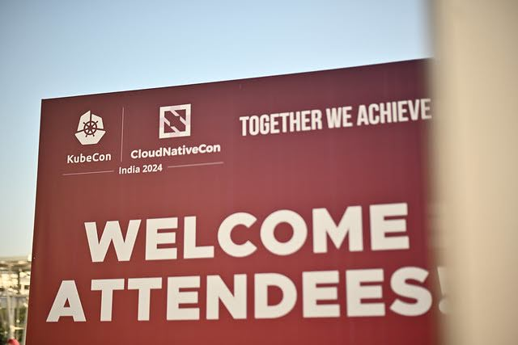
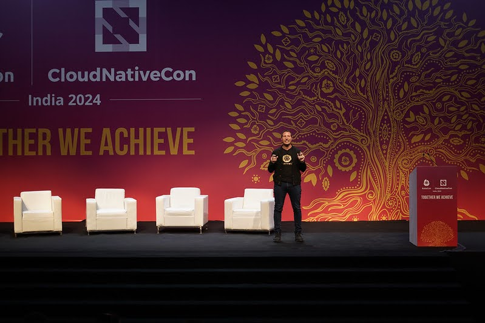
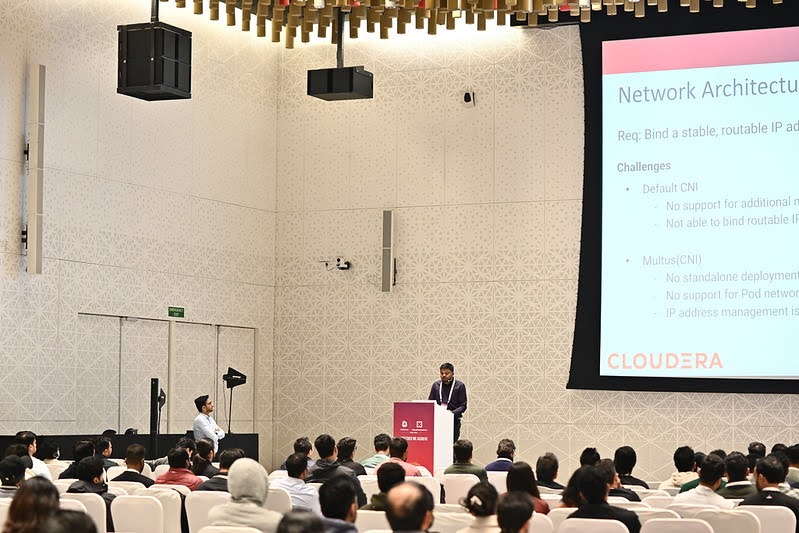

The energy at [KubeCon \+ CloudNativeCon India 2024](https://events.linuxfoundation.org/kubecon-cloudnativecon-india/) in Yashobhumi, Delhi was noticeable. This first-ever KubeCon hosted in India marked a significant milestone in the adoption of cloud-native technologies across the region. With over 4,000 professionals gathering on December 11-12, 2024, the event showcased the latest advancements and celebrated the 10th anniversary of Kubernetes, a technology that has transformed modern application development.

This blog explores the event’s highlights, emphasizing platform engineering trends, keynotes, and actionable insights from breakout sessions and workshops. Whether you're a seasoned Kubernetes expert or just beginning your journey, these takeaways offer valuable guidance for navigating the cloud-native ecosystem.

#### **Kubecon India Highlights**

1. [**Welcome and Opening Remarks**](https://www.youtube.com/watch?v=SN252Atn-io&list=PLj6h78yzYM2P0vFbS4o1I0gRHSiXgLiEe&index=76): Chris Aniszczyk, CTO of CNCF, emphasized the growing global significance of cloud-native technologies and announced the formation of the Linux Foundation India chapter, a move aimed at strengthening the local ecosystem.  
2. [**Flipkart’s Service Mesh Journey**](https://www.youtube.com/watch?v=QCxG8H1F5rc&list=PLj6h78yzYM2P0vFbS4o1I0gRHSiXgLiEe&index=15): I.V. Prasad Reddy and Purushotham Malipedda shared insights into adopting Istio at scale, highlighting challenges, successes, and the transformative impact of service meshes on reliability and scalability.  
3. [**End User Evolution**](https://www.youtube.com/watch?v=ZE6uO-WvBgg&list=PLj6h78yzYM2P0vFbS4o1I0gRHSiXgLiEe&index=13): Rajas Kakodkar (Broadcom), Aparna Subramanian (Shopify), and others shared global cloud-native adoption stories, shedding light on how organizations are overcoming operational challenges to innovate faster.  
4. [**Security and Compliance**](https://www.youtube.com/watch?v=YHkQWN5kC-I&list=PLj6h78yzYM2P0vFbS4o1I0gRHSiXgLiEe&index=45): Solutions like Falco and Kyverno are making zero-trust architectures and compliance easier to implement.  
5. [**Edge Computing**](http://youtube.com/watch?v=n-p-v5bcPug): Lightweight Kubernetes distributions like K3s are driving real-time decision-making in retail, healthcare, and telecom.  
6. [**GenAI on Kubernetes**](https://www.youtube.com/watch?v=8GacuRHQPqE&list=PLj6h78yzYM2P0vFbS4o1I0gRHSiXgLiEe&index=43): Arun Gupta and Kaushal Desai provided actionable recipes for deploying generative AI solutions in cloud-native environments.  
7. [**Building IDPs**](https://www.youtube.com/watch?v=2c0s2pVO8Po&t=30s): Sessions provided insights and guidance for creating developer-friendly platforms that integrate seamlessly with Kubernetes clusters.

#### **Platform Engineering Focus**

Platform engineering emerged as a central theme, with a spotlight on Internal Developer Platforms (IDPs) and tools like Backstage and Crossplane that abstract Kubernetes complexities. Some of the interesting talks centered around platform engineering were:

* **Hybrid Cloud Infrastructure:** How Kubernetes Bridges Multi-Cloud and Legacy Systems and transforming HCI landscape by unifying public, private, and on-premise systems under a single control plane. Tools like KubeVirt and Crossplane streamline multi-cloud and VM management, while solutions like NMState and Multus CNI tackle networking challenges. This approach simplifies operations, enhances flexibility, and modernizes legacy systems for efficient hybrid environments.  
  [Youtube](https://www.youtube.com/watch?v=OX-fBlBZs-c&list=PLj6h78yzYM2P0vFbS4o1I0gRHSiXgLiEe&index=80) | [Slides](https://kccncind2024.sched.com/event/1mVRA/revolutionizing-hybrid-hci-how-kubernetes-transforms-multi-cloud-and-legacy-management-ashik-j-m-sibiraja-l-cloudera)  
* **App of Apps Pattern: Transforming PepsiCo's Delivery Processes:** PepsiCo's adoption of the **App of Apps pattern** has revolutionized their deployment workflow by centralizing application code, configurations, and IaC into a unified platform. This self-service approach has reduced ServiceNow tickets by 50%, deployment time by 25%, and improved MTTR. Key enablers include GitOps with ArgoCD, Helm charts, and OPA policies, streamlining operations and accelerating developer onboarding. Containerization further enhances consistency, scalability, and efficiency, marking a significant shift in PepsiCo's software delivery.  
  [Youtube](https://www.youtube.com/watch?v=2c0s2pVO8Po) | [Slides](https://kccncind2024.sched.com/event/1mVRx/faster-deployments-at-pepsico-with-self-service-continuous-delivery-using-the-app-of-apps-pattern-chaitanya-g-prasanti-kadiyala-pepsico)  
* **Scaling GitOps**: Shivani Mehrotra’s experience scaling ArgoCD for 30,000+ applications offered insights into achieving operational efficiency with declarative infrastructure practices.  
  [Youtube](https://www.youtube.com/watch?v=Oejgk-whUao) | [Slides](https://kccncind2024.sched.com/event/1mVT9/expedia-groups-gitops-revolution-extensive-scalability-testing-on-argocd-for-30k-applications-shivani-mehrotra-expedia-group-mohit-kumar-coforge-limited)  
* **Observability in Platforms**: Intuit’s approach to robust monitoring and logging underscored the importance of proactive issue resolution for platform teams.  
  [Youtube](https://www.youtube.com/watch?v=Oejgk-whUao) | [Slides](https://kccncind2024.sched.com/event/1mVT9/expedia-groups-gitops-revolution-extensive-scalability-testing-on-argocd-for-30k-applications-shivani-mehrotra-expedia-group-mohit-kumar-coforge-limited)  
* **Building High-Throughput Platforms:** Building high-throughput platforms on Kubernetes presents challenges like asynchronous operations, rate limiting, multi-tenancy, and configuration management. Intuit's experience highlights the need for end-to-end asynchronous flows, precise rate limiting for high TPS, careful multi-tenant architecture design, and scalable configuration mechanisms. Rigorous testing and anticipating side effects are crucial for success.  
  [Youtube](https://www.youtube.com/watch?v=pyKow6Ox11Y) | [Slides](https://kccncind2024.sched.com/event/1mVRJ/side-effects-lessons-learnt-while-building-traffic-platforms-serving-15-million-tps-using-k8s-sumit-mathur-sushanth-kamath-a-intuit)

**My Experience**

Attending KubeCon has been an eye-opening experience, providing me with a deep understanding of the latest trends and challenges in the cloud-native ecosystem. I gained valuable insights into advancements in platform engineering, including the transformative role of Internal Developer Platforms (IDPs), GitOps, and tools like Backstage and Crossplane. 

Sessions like “[Building Resilient Kubernetes Clusters](https://www.youtube.com/watch?v=oacoUMdD4_Y)” and “[Implementing GitOps with Flux](https://www.youtube.com/watch?v=Oejgk-whUao)” gave me actionable insights into disaster recovery, node management, and multi-cloud deployments. 

The “[Service Mesh Deep Dive](https://kccncind2024.sched.com/?searchstring=Service+Mesh)” and “[Securing Kubernetes Clusters](https://kccncind2024.sched.com/?searchstring=Kubernetes+Clusters)” provided practical strategies tailored for platform engineers. 

I also got the opportunity to attend an insightful talk by [Atulpriya Sharma](https://kccncind2024.sched.com/speaker/sharma.atulpriya) on the Platforms [**Working Group**](https://static.sched.com/hosted_files/kccncind2024/3e/Atul-KubeCon-India-2024.pdf?_gl=1*opv0uh*_gcl_au*MTkyMzI0NTcxNS4xNzM4MzkxMzI1*FPAU*MTkyMzI0NTcxNS4xNzM4MzkxMzI1) (part of TAG App Delivery), which highlighted the growing momentum around platform engineering globally. 

The [session delved into their mission](https://www.youtube.com/watch?v=Pq_TYQyN0WI) to support platform adoption, showcasing key initiatives like their comprehensive whitepaper and maturity model—tools designed to guide teams at every stage of their platform journey. 

Personally, attending KubeCon was a transformative experience. The Platforms Working Group’s talk was particularly inspiring, showcasing the power of community-driven initiatives and the importance of collaboration in shaping the future of platform engineering.

### **Join the Platform Engineering Movement\!**

Whether you’re new to Platform Engineering or a seasoned expert, we invite you to join the vibrant and collaborative Platform Working Group. This is a space where professionals share knowledge, solve challenges, and shape the future of platform engineering together.

* **Join**:  
  Connect with us on CNCF Slack in the \#WG-Platforms channel: [Slack Link](https://cloud-native.slack.com/archives/C020RHD43BP) (QR Code). Introduce yourself, share your interests, and someone from the team will guide you to get started.

* **Contribute**:  
  Attend [bi-weekly meetings to collaborate on projects and initiatives](https://tag-app-delivery.cncf.io/wgs/platforms/). You can also contribute blog posts, participate in local meetups, or help organize community events.

* **Connect**:  
  Join us at [KubeCon Europe](https://events.linuxfoundation.org/kubecon-cloudnativecon-europe/) in London from April 1- 4 as well as the [Platform Engineering Colocated](https://colocatedeventseu2025.sched.com/overview/type/Platform+Engineering+Day) event. Also, [Kubecon India 2025](https://events.linuxfoundation.org/kubecon-cloudnativecon-india/) is already announced for August 6 & 7 2025, don’t miss to [register](https://events.linuxfoundation.org/kubecon-cloudnativecon-india/register/) and [let's connect](https://www.linkedin.com/in/ompnix/) there. 

#### 

As the cloud-native ecosystem continues to grow, events like KubeCon remind us of the importance of learning, sharing, and contributing to the community. Even if we’re just starting our cloud-native journey or are seasoned experts, there’s always something new to explore and ways to get involved. 

Let’s continue to build, innovate, and shape the future of cloud-native technologies together. [See you](https://www.linkedin.com/in/ompnix/) at [KubeCon Europe](https://events.linuxfoundation.org/kubecon-cloudnativecon-europe/) 2025 and [Kubecon India](https://events.linuxfoundation.org/kubecon-cloudnativecon-india/) 2025\!  