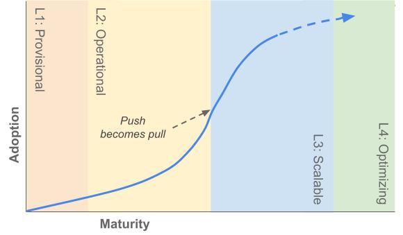

## はじめに

CNCFの最初の[プラットフォームホワイトペーパー](https://tag-app-delivery.cncf.io/ja/wgs/platforms/whitepaper/)では、クラウドコンピューティングのための内部プラットフォームとは何か、そしてそれが企業に提供する価値について説明しています。しかし、その価値を実現するためには、どの組織も自組織のために作られた内部プラットフォームに依存していることを念頭に置きながら、組織にインパクトのある成果や実践方法を熟考し、意図的に追求する必要があります。それが、サードパーティ製サービスの使用方法のドキュメントに過ぎないとしてもです。この成熟度モデルは、その熟考のためのフレームワークを提供し、どの組織においても改善の機会を見つけるための手助けをします。

## プラットフォームエンジニアリングとは何か

DevOpsによって約束される部門横断的な協力に触発され、プラットフォームやプラットフォームエンジニアリングが、企業においてその協力の明確な形として登場しました。プラットフォームは、共通の機能[^1]、フレームワーク、および体験を収集、整理し提供します。このワーキンググループおよび関連文書の文脈では、プロダクトチームやアプリケーションチームなどの[内部ユーザー]()の作業を促進し、加速するプラットフォームに焦点を当てています。

[プラットフォームエンジニアリング]()とは、開発者やユーザーに対してそのようなコンピューティングプラットフォームを計画し提供するプラクティスです。これには、プラットフォームおよびその能力の総体、つまり人、プロセス、ポリシー、テクノロジーに加え、それらを推進するために望まれるビジネス成果も含まれます。

最初に、完全な文脈を理解するために、[CNCFプラットフォームホワイトペーパー](https://tag-app-delivery.cncf.io/en/wgs/platforms/whitepaper/)をお読みください。

## このモデルの使い方

プラットフォームエンジニアリングがここ数年で注目されるようになると、いくつかのパターンが明確になってきました。これらのパターンと観察を漸進的な成熟度モデルにまとめることで、[プラットフォームチーム]()を直面するかもしれない課題や目指すべき目標へと向けることを目指しています。
各特性は、その特性の各レベルにある個々のチームや組織の特徴の連続体として説明されます。読者は、このモデルにおいて自身がどのレベルに位置するかを見極めるとともに、隣接するレベルの目標を把握することが期待されます。

特筆すべきこととして、より高いレベルの成熟度ほど、より多くの資金と人々の時間が必要とされます。したがって、最高レベルに達すること自体を目標とすべきではありません。各レベルは、その段階で現れるべき品質を表しています。読者は、自らの組織と現在の状況において、必要な投資に対してこれらの品質から利益を得られるかどうかを検討する必要があります。

各特性は独立して評価され、進化することを意図していることを念頭に置いてください。しかし、どんな社会技術システムでも同様に、これらの特性は複雑で相互に関連しています。したがって、ある特性を改善するためには、別の特性でも最低限のレベルに達している必要があるかもしれません。

プラットフォームの実装が組織ごとに異なることを認識することも重要です。_あなたのグループ_のクラウドネイティブへの変革の現状を評価することを確実に行ってください。この評価に活用できる素晴らしいリソースは、[Cloud Native Maturity Model](https://maturitymodel.cncf.io/)です。

最終的にこのモデルは組織に対して、意図的な計画を通じて、プラットフォームエンジニアリングの規律と、成果としてのプラットフォームを成熟させることを奨励しています。このような計画と規律自体が、成熟したプラットフォーム開発と継続的な進化に必要です。

一般的に、組織をモデルにマッピングすることは、現状を把握し、漸進的な反復と改善を_可能にする_ために行うということを忘れないでください。[マーティン・ファウラー](https://martinfowler.com/bliki/MaturityModel.html)はこの点についてうまく言及しています。「成熟度モデル評価の真の成果は、あなたがどのレベルにいるかではなく、改善のために取り組む必要がある事項のリストです。あなたの現在のレベルは、次に獲得すべきスキルのリストを決定するための中間作業に過ぎません。」その意味で、モデルの中で自分自身を見つけ、隣接するレベルでの目標を特定するように努めてください。

## 本文書の背景

文書がどのような背景で書かれたかを理解することは価値があります。以下のセクションでは、モデルの背後にあるいくつかの背景と、読者であるあなたに対して期待する点を説明します。

### 想定読者

各読者は独自の文脈を持ち、このモデルから独自の学びを得るでしょう。以下に、我々が想定するいくつかのペルソナと、このモデルに対するそれぞれの動機を示します。

* **CTO、VP、技術部門のディレクター**: デジタルトランスフォーメーションと開発者の生産性向上への道筋を描くことを目指すリーダーたち
* **エンジニアリングマネージャー**: エンジニアがより少ないオーバーヘッドと高い効率で価値を提供できるよう支援を求めるグループや個人
* **エンタープライズアーキテクト**: 現代の技術環境を先導し、技術問題に対して価値志向かつソリューション志向の視点を求める個人
* **プラットフォームエンジニアおよびプラットフォームプロダクトマネージャー**: プラットフォームの構築者と利用者にとって、最良の体験を構築しようとするチームや個人
* **プロダクトベンダーおよびプロジェクトメンテナー**: ユーザーがプラットフォームと機能で成功を収めるために、ツールを設計したりメッセージを届けたいと考える組織やエンジニア
* **アプリケーションおよびプロダクト開発者**: 内部プラットフォームに対して何を期待できるかをより詳細に理解しようとするプラットフォームユーザー

### レベルについて理解する

このモデルは、組織やプラットフォームチームを「レベル1」や「レベル4」に完全に分類することを意図したものではありません。各特性は他の特性とは独立して検討されるべきです。つまり、各レベルにおける特徴はその特性における連続体をなしていますが、必ずしも同じレベルの他の特性と結びついている必要はありません。さらに、多くの組織では、チームや仕事に対して、1つ以上のレベルの特徴が当てはまるでしょう。というのも、どのレベルも本質的に良い悪いがあるわけではなく、チームの目標に対するコンテキストに依存するものだからです。

各レベルのラベルは、あなたの組織におけるプラットフォームエンジニアリングの影響度合いを反映することを意図しています。あるレベルであなたの組織を認識することで、次のレベルに続く機会への洞察を得られます。低いレベルはより戦術的なソリューションであり、高いレベルはより戦略的なソリューションです。

これは、他のデジタル製品開発と同様の、プラットフォーム開発と成熟のための潜在的なプロセスをもたらします。まず、問題と新しい解決策の必要性を認識し、次に仮説としての最小限の実用的な製品を開発し、第三に、問題をより良く解決し、顧客により適合するように反復を行い、最後に、多くのチームやユーザーの問題を解決するために製品を拡大し最適化します。

CNCFクラウドネイティブ成熟度モデル](https://maturitymodel.cncf.io/)と同様に、このモデルは、成功するビジネス成果は人、プロセス、ポリシーと技術をバランス良く組み合わせることによってのみ達成できることを強調しています。特に、このモデルは、しばしば単一の内部チームの範疇に完全には収まらない特性を導入しており、むしろエンジニアリング部門全体、そして多くの場合、さらに幅広い組織の協力を必要とします。

### ですが、うまく当てはまるように思えません

それは全く問題ありません！すべての組織やグループには、それぞれ固有のダイナミクスやパラメータがあります。

この文書の目的は、厳格な公式を示すことではなく、自身の状況に適用できるフレームワークを提供することです。すべての言葉があなたにとって適切とは限りませんが、このコンテンツがあなた自身のプラットフォームの旅を振り返り、有益な部分を取り入れ、そうでないものは捨て置いていくきっかけになることを願います。

このモデルの目的は、プラットフォームエンジニアリングの実務者、ステークホルダー、その他の関係者が彼らの旅路を導くためのツールを提供することです。プラットフォームの設計と実装は厳密な科学ではなく、個々のプロジェクトや組織のニーズ、特定の時間や場所に依存します。

## モデル表

| 
特性 
  |                                                                                                    | 暫定的である             | 戦略的である       | スケーラブルである             | 最適化している       |
|:--------------------------------------|:---------------------------------------------------------------------------------------------------|:-------------------------|:-------------------|:-------------------------------|:---------------------|
| [投資](#投資)                         | _プラットフォームの機能に対して、人員と資金がどのように割り当てられているか_                       | ボランティアまたは一時的 | 専任チーム         | プロダクト                     | 活発なエコシステム   |
| [採用](#採用)                         | _ユーザーはなぜ、どのようにして内部プラットフォームやその機能を発見し、利用しているか_             | 一貫していない           | 外部からの動機づけ | 内発的な動機づけ               | プロアクティブな参加 |
| [インターフェース](#インターフェース) | _ユーザーがどのようにしてプラットフォームの機能と対話し、利用しているか_                           | 機能毎に独自の手順       | 標準ツール         | セルフサービスのソリューション | 統合されたサービス   |
| [戦略](#戦略)                         | _プラットフォームとその機能が、どのように計画され、優先順位がつけられ、開発され、維持されているか_ | リクエストに応じて       | 中央による追跡     | 中央からの支援                 | マネージドサービス   |
| [計測](#計測)                         | _どのようなプロセスでフィードバックと学びを収集し、取り入れているか？_                             | アドホック               | 一貫性を持った収集 | 洞察の獲得                     | 定量的かつ定性的     |

## モデルの詳細




<h4 style="color:gray;padding-bottom:10px;padding-top:20px"><i>プラットフォームの機能に対して、人員と資金がどのように割り当てられているか</i></h4>

プラットフォームおよびプラットフォームエンジニアリングへの投資は、共通機能の構築と保守のために予算と人員を割り当てるプロセスです。一般的にイニシアティブ（取り組み）は、ボトムアップで自然発生的に積み上げられたもの、あるいはトップダウンで推進されるものとして説明されます。いずれの場合も、インパクトのある仕事を推進するのは、持続的な努力に投資する能力です。この特性は、投資の規模と幅が、どのようにプラットフォームの成功に影響を与えうるかを表します。

### レベル1、暫定的である - ボランティアまたは一時的

個々の能力(Capability)は、共通または重要な機能の共通基盤を提供するために存在します。これらの能力は、計画的かつ意図的に資金が提供されるのではなく、必要に迫られて構築され、保守されます。

これらの能力は、一時的に割り当てられた人々や自主的に参加する人々によって構築および保守されます。中央から意図的に資金提供や人員配置が行われることはありません。これらは、ユーザーのその時点における戦術的な要件に依存しています。

#### 特徴:

* 「ヒット」チームや「タイガー」チームは、緊急の要件に対処するために編成されます。これらのチームは短命であり、長期的な計画やサポートを提供する時間は割り当てられません。
* 移行、改善、または拡張はしばしば「もしできればなお良い」作業項目と見なされ、「研究」や「ハックデー」の努力に依存します。
* 緊急のセキュリティパッチなどの新しい要件に取り組む際に、プロセスの改善や自動化が導入されることがありますが、再利用可能または持続可能な方法でソリューションを構築するためのサポートはありません。
* 従業員は、自分の主な役割外で行っている作業量に対して、燃え尽きやフラストレーションを訴えます。

#### シナリオの例:

* テスト環境の専門家と見なされている特定の従業員がいます。この従業員は善意により、より良いテスト環境を実現しようと限られた投資の中で取り組んでいますが、ソリューションの保守が行われず、壊れたテスト環境をトリアージする方法について知識が共有されていないため、リスクの増加を招いています。
* エンジニアは、収益を生み出す機能を求める管理職からのプレッシャーがないときに、能力向上に投資することを奨励されています。これは、CI/CDパイプラインの自動化や改善に、スプリントの最後の数日間になって取り組むことを意味します。このような副次的な取り組みに時間が割けないまま、数ヶ月に渡って過密なスプリントが続くこともあるため、これらの改善が突発的に行われることも珍しくありません。

### レベル2、戦略的である - 専任チーム

持続的に人的およびリソース的なサポートをするために、予算と人員が割り当てられます。割り当てられた人員は、ソフトウェアデリバリーの高速化のために一般的に必要とされる一連の機能を提供する任務を負います。これらのチームはしばしば、技術的な要求を、受け身的に満たすことに焦点を当てます。彼らはDevOps、エンジニアリング支援、開発者体験（DevExまたはDevX）、共有ツール、センター・オブ・エクセレンス、あるいはプラットフォームと呼ばれることがあります。彼らの資金は中央集権的に調達され、コストセンターとして扱われます。そして、直接的なバリューストリームやアプリケーションチームに対する彼らの影響は測定されていません。このレベルのプラットフォームチームの組織やバリューストリームへの影響をマッピングすることは困難であり、そのためにこれらのチームへの資金提供を維持し続けることが困難になる場合があります。

#### 特徴:

* チームはほぼ全員が技術のジェネラリストで構成されています。
* チームの予算には、彼らの作業に関連するインフラコストが含まれることがあり、予算の話し合いにおいて重要なポイントとなることがよくあります。
* バックログの項目は多くの技術にまたがっており、そのため頻繁かつ大きなコンテキストスイッチが発生します。
* このチームは、チームのスコープに含まれていないとしても、まだ対応されていないギャップを埋める最初の存在であることが多いです。このチームは所有者のいないリソースのオーナーシップを引き受けます。
* アサインされたメンバーには、彼らのデザインや実装を検証するための、顧客調査の時間や経験がほとんどありません。

#### シナリオの例:

* アプリケーション開発者は、アプリケーションのビルド時間が長いことを問題として提起します。中央のチームがビルド時間を50%削減する任務を受けます。彼らは、個々のアプリケーションビルドを改善するほどソフトウェアに詳しくないため、CIランナーのサイズと数を倍増させることでこれを解決します。これにより、中央のチームの予算に懸念が生じます。なぜなら、生産性の向上がこの増加したインフラコストに対して直接的に測定できないからです。

### レベル3、スケーラブルである - プロダクト

内部プラットフォームおよびその能力への投資は、企業の外部向けの製品やバリューストリームへの投資に似ています。つまり、顧客に提供すると期待される価値に基づいているということです。プロダクトマネジメントとユーザーエクスペリエンスは明示的に考慮の対象とされ、投資が行われます。プラットフォームの顧客の直接的なバリューストリームや製品に対する影響を反映するために、費用配賦システムが使用されることがあります。企業は、データドリブンなパフォーマンス指標やフィードバックループを使用して、適切な取り組みに資金と人員を割り当てます。プラットフォームチームは最終的にビジネスそのものを最適化し、収益性の向上に貢献することができます。

#### 特徴:

* プラットフォームチームは、内部サービスや技術チームには従来存在しなかった役割、例えばプロダクトマネジメントやユーザーエクスペリエンスの役割をスタッフに配置します。
* チームは、提供する価値と高レベルの機能目標を示すロードマップを組織内に公開します。
* 機能群は、実装の品質とユーザーエクスペリエンスの両面から、設計、提供、及び展開後にでテストされます。
* 機能の削除は、会話の重要な位置を占めています。これは、無秩序に広がった保守されないかもしれない資産ではなく、十分にサポートされ、よく使われる一連の機能を手に入れることを目的としています。

#### シナリオの例:

* プラットフォームの利用状況に関するメトリクスから得られたデータは、最も影響力のある取り組みに対して資金とスタッフを配分するための意思決定に役立ちます。

### レベル4、最適化している - 活発なエコシステム

プラットフォームチームは、基本的な機能を超えて、組織全体の効率と効果を高める方法を見つけます。プラットフォームのコアメンテナは、新製品の市場投入までの時間を最適化し、企業全体のコストを削減し、新しいサービスへのガバナンスとコンプライアンスの効率的な適用を可能にし、ワークロードを迅速かつ容易にスケールする、などの横断的な要件を意図的に追求しています。これらのコアメンテナは、能力(Capability)のスペシャリストが、プラットフォームの既存および新規のパーツに、シームレスに要件や提供物を統合できるようにすることに焦点を当てます。さらに、組織は、セキュリティ、パフォーマンス、品質などの専門領域の人材とリソースをプラットフォームフレームワークとの連携に集中させ、製品チームが中央のチームのバックログに依存せずに会社の目標に迅速に準拠できるようにする高度な機能を導入します。

#### 特徴:

* スペシャリストがプラットフォームの機能を拡張し、新しい機能を導入できるようにすることが優先事項となります。
* 組織はスペシャリストを中央に集めることで、彼らの知識とサポートをプラットフォームの機能を通じて広めることができます。

#### シナリオの例:

* マーケティング部門は、プラットフォーム構築者と協力して一貫したユーザートラッキングを導入し、マーケティングの取り組みを製品の成果に関連付けるようにします。
* 自動化の取り組みにより、データベースのプロビジョニングにかかる時間をインスタンス当たり30分削減し、年間1,000万ドルの節約を実現します。




<h4 style="color:gray;padding-bottom:10px;padding-top:20px"><i>ユーザーはなぜ、どのようにして内部プラットフォームやその機能を発見し、利用しているか</i></h4>

「採用」は、組織がプラットフォームの機能をどのように、どれだけ使うかだけでなく、それを行う動機についても説明します。初期段階では、多くのターゲットユーザーは自分たちがプラットフォームを使用していることに気づかず、むしろ自分たちのツールをさまざまな内部ソースからのアドホックな機能の集合体と見なします。これが成熟すると、一貫性をもって管理され、ユーザーに提示される機能のグループ、つまり1つ以上のプラットフォームになることがあります。機能がより洗練され、発見しやすくなるにつれて、プラットフォーム使用の動機は、命令や報酬といった外的なものから離れていくのが一般的です。これにより、ユーザーはプラットフォームの機能を自ら選択し、理想的には自分たちの努力をプラットフォーム全体のエコシステムに投資するようになります。

<figure align="center">

 
<figcaption align="center" padding="50px">
<em>プラットフォームの採用の一般的な成長パターンを示す図。多くの場合、プラットフォーム構築者によって推進され、緩やかにスタートします。一旦プラットフォームがユーザーに十分な価値を提供すると、成長がユーザーによって牽引されるようになり、採用曲線が急になります。</em>
</figcaption>
</figure>
 
 

### レベル1、暫定的である - 一貫していない

共有プラットフォームや機能の採用は断続的で一貫性がありません。必要な支援サービスや技術を選択し統合するための組織全体の戦略やガイダンスは存在しません。各チームは自分たちのプロセスを改善するためにプラットフォームのプラクティスを活用するかもしれませんが、組織を横断した協調的な取り組みや標準化はありません。このレベルの採用は、一貫したアプローチが欠如していることと、内部で提供されるツールよりも外部のツールがより効果的であるという考え方によって特徴づけられます。

#### 特徴:

* 一回限りのツール、サービス、機能が、組織内のさまざまなチームや部門によって管理され、利用されています。
* プロバイダーによって管理された（いわば「クラウド」）サービスは、一貫性のない方法で採用され、使用されており、標準的なプラクティスやポリシーがなく、内部設定は見つけにくく、使いにくいです。
* アプリチームやサービスチームは、ツールや機能を、中央集権的なプロセスからではなく、噂や偶然の会話を通じて、無秩序に発見しています。
* コンポーネントや機能の調整と再利用は、エンドユーザー（アプリケーションチーム）によってのみ行われています。
* 各プロダクトチームは、それぞれ自分たちのアプリケーションを展開するためのスクリプトやツールを保守しています。

#### シナリオの例:

* 銀行サービスにはデータベースが必要です。開発者は他のチームの友人から、AWSアカウントをリクエストしてRDSデータベースをセットアップできることを知ります。また、別のチームからそのデータベースをプロビジョニングするためのTerraformスクリプトを見つけます。監視にはその場しのぎ的にCloudWatchを使用し、Terraformスクリプトを実行する前に、AWSコンソールから手動でHashicorp Vaultのインスタンスにシークレットをコピーします。

### レベル2、戦略的である - 外部からの動機付け

組織は共有されたプラットフォームとその機能の価値を認識し、それらを奨励し育成することに努めています。内部的な指示により、いくつかのユースケースでは共有プラットフォームサービスの使用が奨励されるか、あるいは義務付けられています。いくつかのプロダクトチームは他のチームよりもプラットフォーム機能を多く使用していますが、その機能は組織内の一般的なユースケースをカバーしているものの、特殊なユースケースについては対応しておらず、それらの例外的なユースケースを共通プラットフォームに追加することは困難です。

ユーザーが機能を発見する過程や、その使い方は一貫していません。プロダクトチームのユーザーがプラットフォームチームの指示を受けない限り、サポートされている機能を見つけられない可能性があります。

#### 特徴:

* ある程度の外的な動機がプラットフォーム機能の使用につながります。例えば：
  * 個人の評価などのインセンティブ
  * 本番リリースや資金提供を受けるために、使用の義務を課すこと
* プラットフォームの機能の利用は断片的です — ユーザーはある機能を利用しているかもしれませんが、他の利用可能な機能に気付いていない、または採用に興味がない場合があります。
* ユーザーはプラットフォーム機能の使い方を学ぶ意欲が低く、オフィスアワーやヘルプデスクなどのフォーラムを通じたプロバイダーとの共同作業に大きく依存しています。
* プラットフォームユーザーは、問題や解決策を共有するための非公式な実践コミュニティに参加するよう奨励されていますが、参加者は限られているかもしれません。

#### シナリオの例:

* あるエンジニアリング組織が標準のデプロイメントツールを決定し、すべてのチームにその使用を指示します。新しいプロセス（リリースノートの伝達など）はその標準に基づいて構築されます。チームは他の種類のデプロイメントスクリプトの使用を停止し、共通のツールを使用するよう指示されます。これは、新しいプロセスではニーズが満たされないにもかかわらず、そのプロセスを理解できなかったり、拡張することを許されなかったりするチームにとっては難しいことです。

### レベル3、スケーラブルである - 内発的な動機づけ

プロダクトチームの認知負荷を軽減しつつ高品質なサポートサービスが提供される、という明確な価値があるため、プロダクトチームやサービスチームのユーザーはプラットフォームとその機能を選択します。ドキュメントと使いやすいインターフェースにより、プロダクトチームのユーザーはプラットフォーム機能を迅速にプロビジョニングして使用することができます。ユーザーは、機能を自分たちで開発したりプロバイダーを導入する代わりに、内部プラットフォームで実現されているものを選択します。

#### 特徴:

* プラットフォームの採用は自立的に持続可能です。採用の主な推進力は、プラットフォームを使用するようにユーザーに義務付ける外部からの動機や報酬ではなく、ユーザーを惹きつけるようなプラットフォームそのものの価値です。
* 一つまたはいくつかのプラットフォーム機能を使用してその価値を理解すると、ユーザーは他の機能を探し、それらの体験が機能間で一貫していることに気付きます。個々の機能は孤立しているのではなく、より大きなプラットフォームの機能セットの一部であると期待されます。
* プラットフォームチームは、ユーザーフィードバックを集め、ロードマップを共有し、ユーザーとの対話のためのオープンフォーラムを維持することで、プラットフォームの自然な採用を奨励します。
* アプリケーションチームおよびプロダクトチームは、例えば費用配賦システムを通じて、プラットフォームの機能に対価を払う価値を認めています。
* ユーザーはオープンフォーラムや共有されたロードマップを通じて、フィードバックを共有したり、今後の機能について学んだりすることができます。
* セルフサービスポータル、ゴールデンパステンプレート、その他のドキュメントが迅速な利用を可能にします。

#### シナリオの例:

* あるアプリケーションチームは、以前、新しいデータベースのリクエストに成功しました。そのプロセスは理解しやすく、ほとんど待ち時間がありませんでした。さらに、バックアップや監視のような、チームが本番環境まで問題なく使用を進められるための重要な機能が含まれていました。この経験により、後にチームがキューを必要とした際の最初の行動は、内部プラットフォームの選択肢を確認するというものになりました。元々は特定のキューの技術を使用するつもりでしたが、彼らの組織向けにいかにうまく統合されているかを知っていたため、最終的には内部で提供されているものを選びました。

### レベル4、最適化している - プロアクティブな参加

プロダクトチームのユーザーは、エコシステムに参加して貢献することで、さらにプラットフォーム機能に投資します。いくつかの貢献は既存の機能を改善し修正します。他の貢献は新しいユースケースに対応するための新しい能力や機能を導入します。プロセスやサービスが定義され、ユーザーが要件を特定することや、複数のプロダクトチームやプラットフォームチームからの貢献を調整することが可能になります。新機能は一貫したインターフェースやポータルを通じて公開され、完全なドキュメントと標準化されたバージョニングが提供されます。

#### 特徴:

* アプリケーション/サービスチームのユーザーは、プラットフォームの機能に対して修正、機能追加、フィードバックを提供できるようになっています。
* 外部プロジェクトや標準を戦略的に活用して、メンテナンスコストを削減し、新機能の提供を加速させ、組織の人員を最大限効果的に使用します。
* 新しい機能や改善は、イシューボードやプルリクエストを通じて非同期的に調整されます。ドキュメントやチェックリストにより、貢献者は自発的に開発を進めることができます。
* デベロッパーアドボケイトや内部アンバサダーが、内部ユーザーコミュニティをつくり、サポートすることで、プラットフォームのオーナーシップをアプリケーションチームやサービスチームの貢献者にも拡大します。
* プラットフォームを使用することは、組織で働く上での最良の方法として、リーダーシップと個人貢献者の両方から認識されています。
* プラットフォームエンジニアは、プロダクトチームの計画に参加して要件を把握すると共に、関連する既存機能を提案します。

#### シナリオの例:

* あるチームが代替のバックアッププランを望んでいます。これを共通の提供物として提案したものの、再利用の見込みが少ないため低優先度とされました。提案したチームは自分たちのソリューションをプラットフォームフレームワークに統合し、組織全体で利用できるようにすることを選択しました。最初はアルファ版として提供されますが、すべての運用要件を満たした時点でプラットフォームのコア機能に昇格することができます。




<h4 style="color:gray;padding-bottom:10px;padding-top:20px"><i>ユーザーがどのようにしてプラットフォームの機能と対話し、利用しているか</i></h4>

プラットフォームによって提供されるインターフェースは、ユーザーがこれらのプラットフォームの提供物とどのようにやり取りして、機能をプロビジョニング、管理、および監視するかに影響を与えます。インターフェースには、チケット管理システム、プロジェクトテンプレート、グラフィカルなポータル、自動化に役立つAPIやコマンドライン（CLI）ツールなどが含まれます。

インターフェースの主な特徴には、初回リクエスト、メンテナンス、インシデント対応などの主要なユーザージャーニーにおいて、どれだけ発見しやすく使いやすいかが含まれます。ここでの成熟度が高いほど、より統合され、一貫性があり、自動化され、サポートされたインターフェースであることを表します。

### レベル1、暫定的である - 機能毎に独自の手順

個々の機能やサービスをプロビジョニングするための異なるプロセスが存在しますが、インターフェースの一貫性は考慮されていません。カスタムメイドのプロセスは個人やチームの直近のニーズに対応します。また、プロバイダーが自動化された実装スクリプトを使用していたとしても、やはり手作業の介入に依存しています。

これらのソリューションのリクエスト方法は、人から人へと伝えられます。サービスをリクエストするプロセスには標準化と一貫性が欠けています。プラットフォームサービスのプロビジョニングと使用には、機能提供者からの深いサポートが必要とされる可能性が高いです。

このレベルは、中央の要件と標準がないため、会社によって要求が特定されておらず、文書化されていない場合に適しています。これは、初期段階の企業やプラットフォームの取り組みを行っているチームにとって特に効果的です。このような環境では、チームはプロセスと機能を自分たちのニーズに合わせて進化させる自由が与えられ、より迅速に成果を出すことができ、標準化のコストを後で必要になった時にのみ払うことができます。

#### 特徴:

* ユーザーとのインタラクションは主要な議題ではなく、新機能の設計や提供の際にインタラクションがテストされることはほとんどありません。
* 機能は主に手動のリクエストを通じて提供されますが、プロバイダーがユーザーリクエストをプロビジョニングするために必要な活動の一部または全てを自動化することを選ぶ場合もあります。
* 表面的には「簡単」なリクエストも、正しいプロセスを見つける必要があるため複雑になります。
* 時にあるプロセスが許可されたもののように見えても、異なる部門やチームが関与するとユーザーが問題に直面します。

#### シナリオの例:

* アプリケーションチームは、彼らの新しいチャレンジについてパフォーマンスのテストしたいと考えています。そのためには、正確なパフォーマンス測定を行うために十分なテストデータが含まれる、隔離された環境が必要です。前回このリクエストをしたときは、以前のチームメイトが環境を利用できていましたが、彼は既にチームを離れており、誰もその環境を再現する方法を知りません。最終的に、インフラチームのエンジニアと繋がり、数日で環境をプロビジョニングしてもらうことができました。
* プロダクト開発の探索段階にあるチームは、新しいクラウドサービスをプロビジョニングするために独自のプロセスを使用しており、彼らのソリューションについて、さらに投資に値するかどうかを検証する必要性は生じていません。

### レベル2、戦略的である - 標準ツール

プロビジョニングやプラットフォームおよび機能の監視のための、一貫性のある標準的なインターフェースが存在し、広範なニーズを満たしています。ユーザーは利用可能な機能を見つけ出し、必要な機能をリクエストすることができます。

ドキュメントやテンプレートの形で、「舗装された道」や「ゴールデンパス」が提供されています。これらのリソースは、標準に準拠したテスト済みのパターンを使用して、典型的な機能をプロビジョニングおよび管理する方法を定義します。一部のユーザーはこれらのソリューションを自分で使用することができますが、これらのソリューションは依然として深い専門知識を必要とするため、管理者からのサポートが引き続き重要です。

#### 特徴:

* 技術的なソリューションは、特定の問題領域に特化したツールで構築されており、必ずしもユーザーに馴染みのあるツールではありません。
* 共通の道筋に対しては投資がありますが、その道筋から外れるとカスタマイズの選択肢が少ないことがすぐに明らかになります。これは、単一の選択肢の構築に焦点を当てていたためです。
* 標準化が進むことで、非公式の内部グループが形成され、集まり、良いプラクティスを共有し、共通の問題を克服することができます。
* チームがテンプレートを入手してカスタマイズしてしまうと、中央チームからの変更をマージできなくなります。これによって機能実装にばらつきが生じることがあります。

#### シナリオの例:

* 中央チームが、さまざまな種類のインフラをプロビジョニングするための、Terraformモジュール、Kubernetesコントローラー、およびCRDを収集、整理しています。
* 共有場所には、組織横断のソリューションに関する包括的なドキュメントが含まれています。

### レベル3、スケーラブルである - セルフサービスのソリューション

ソリューションはユーザーに自律性を提供し、管理者からのサポートをほとんど必要とせずに利用できます。組織は（機能の）発見可能性と、異なる機能間でユーザー体験を応用できるような、一貫したインターフェースのソリューションを奨励し、支援します。セルフサービスであるものの、これらのソリューションにチームが気付き、実際に使用する必要があります。この体験を向上させるために、ユーザーがプラットフォームの機能をより迅速に採用し、統合できるようなガイド付きで簡素化された内部言語が導入されることがあります。これにより、ユーザー中心で、セルフサービスで利用でき、一貫性のある機能の集合が生まれます。

#### 特徴:

* ソリューションは「ワンクリック」実装として提供されており、チームは機能がどのようにプロビジョニングされるのかを理解しなくても利用できます。
* ソリューションの作成は容易ですが、Day 2やそれ以降のソリューションの管理については、あまり使い勝手がよくないかもしれません。
* 利用可能なソリューションの道筋は依然として狭く、ユニークな要件を持つユーザーは次にどう進めるべきか分からない状況が続いています。

#### シナリオの例:

* データベースの作成と管理を抽象化し、接続文字列、秘密データの保存場所、監視データのダッシュボードなど、プラットフォームの機能を活用するために必要な情報をユーザーに提供するAPIが用意されています。

### レベル4、最適化している - 統合されたサービス

プラットフォームの機能は、チームが既に使用しているツールやプロセスに透過的に統合されています。たとえば、デプロイされたサービスの監視やアイデンティティ管理など、いくつかの機能は自動的にプロビジョニングされます。プラットフォームの機能はよく考えられたビルディングブロックとなっているため、ユーザーが用意されたサービスの限界に達しても、内部向けの提供物の使用をやめることなく、自動化されたソリューションを乗り越えてニーズに応じてカスタマイズする機会があります。これらのビルディングブロックを使って、透明性がありつつ自動化された構成が作り上げられており、必要に応じてより深いカスタマイズを可能にしながら、高レベルのユースケースに対応します。

#### 特徴:

* 組織にとってどの機能が差別化要因となるか、どの機能がそうでないかが明確であるため、内部チームは標準技術で対応できない領域に対してのみカスタムソリューションに投資することが許されます。
* 機能は一貫した方法で提供されますが、機能の使い方は一つに限定されません。スクリプトから使用するCLIツールが最適なものもあれば、ユーザーがエディタやIDEでコードを書く環境に統合することで恩恵を受けるものもあります。
* 各機能の価値は、ソフトウェア開発およびリリースのフローに焦点を当てることで拡張され、機能をどのように組み合わせてより高レベルの提供物にするかに重点が置かれます。
* 機能はしばしばパッケージで提供されますが、上級ユーザーはこれらの高レベルの提供物を分解して、必要に応じて最適化することができます。

#### シナリオの例:

* 監視エージェントがすべてのワークロードに注入され、すべてのアプリケーションの前にOIDCプロキシが配置されます。
* デフォルトでは、すべての新しいプロジェクトにタスクランナー（パイプライン）内のスペースと実行環境（K8sネームスペース）が提供されますが、プロジェクトはサーバーレスランタイムなどの他のオプションを選択することもできます。
* ServiceNowポータルのカタログからユーザーが「データベースのプロビジョニング」を選択します。自動化によりRDSデータベースがプロビジョニングされ、ユーザーにURLと認証情報を取得する場所が送信されます。




<h4 style="color:gray;padding-bottom:10px;padding-top:20px"><i>プラットフォームとその機能が、どのように計画され、優先順位がつけられ、開発され、保守されているか</i></h4>

プラットフォームの運用とは、新しいリクエストの受け入れ、初期リリース、アップグレードや拡張、継続的な保守と運用、ユーザーサポート、さらには廃止や終了を含む、プラットフォームの能力とその機能をライフタイム全体にわたって実行しサポートすることを意味します。組織およびそのプラットフォームチームは、作成および維持するプラットフォームと能力を選択し、最も価値があり影響力のある取り組みを優先することができます。

特に、機能を提供するための作業のほとんどは初期リリース後に費やされます。これには、シームレスなアップグレード、新機能や改善された機能の提供、運用サポート、エンドユーザーの支援と教育が含まれます。したがって、影響力があり価値のあるプラットフォームは、長期的に持続可能な運用と信頼性のために事前に計画を立て、プラットフォームを管理する必要があります。

### レベル1、暫定的である  - リクエストに応じて

プラットフォームと機能は、アドホックなプロダクトチームのリクエストと要件に基づいて、受動的に開発、公開、更新されます。プロダクトチーム自身が、自ら必要とする機能を計画し、構築する必要があるかもしれません。

新しい機能を構築するチームが独立した中央のチームであれ、自身のニーズに応じてそれを行うアプリケーションチームであれ、他の使用者をサポートするに当たっては非公式な責任しか負いません。彼らは積極的に保守することは期待されておらず、提供物の品質を評価するためのプロセスもほとんど存在しません。このレベルでは、セキュリティの脆弱性が発見されたり、バグが使用を妨げたり、新しい要件が到来するまで、多くの場合何の作業も行われません。そのような事態が発生した場合には、急いで新たな受動的な計画が実施されることがあります。

#### 特徴:

* 個々のアプリケーションチームの差し迫ったニーズを満たすために機能が作成されます。
* コア機能の最初の提供には焦点が当たりますが、継続的なメンテナンスや持続可能性についての計画はありません。
* 機能の実装は一般的に古くなっており、更新が待たれる状況です。
* 脆弱性の発見など、機能に対する突発的で大幅な変更により、急激な作業の増加がもたらされます。
* 変更は計画的なダウンタイムと計画外のダウンタイムの両方を引き起こす可能性があります。
* 各アップグレードは、それ毎に個別の方法で行われ、プロセスを考案するための時間と調査がアップグレード毎に必要です。

#### シナリオの例:

* Log4Shellのセキュリティ脆弱性が発表され、組織はその脆弱性が存在する可能性のある箇所を調査し、パッチを施すための特別チームを立ち上げます。特別チームが影響範囲を特定した後は、チーム毎に異なる方法でサーバーやアップグレードプロセスが管理されているため、彼らは多くの異なるチームと協力して作業を進める必要があります。この作業が完了したと判断したとしても、別の箇所で問題が発見されないという確信の程度はかなり低いです。

### レベル2、戦略的である - 中央による追跡

プラットフォームと機能は中央で文書化され、発見可能であり、機能のライフサイクルを計画し管理するためのプロセスは少なくとも簡単には定義されています。各サービスと機能について、責任の所在と所有者が明文化されています。ライフサイクル管理プロセスは、所有者とその優先順位に依存しており、機能によって異なります。中央のチームが、未実装の機能のインベントリを管理、または要求に応じて生成することができ、現在の機能のメンテナンス状況が分かるようにします。これにより、組織は機能提供とアップグレード要件の遵守に向けた進捗を追跡することができます。

#### 特徴:

* アプリケーションチームは、差し迫ったニーズに応じて新たな機能を作成します。
* 中央チームは、組織横断で利用可能な共有サービスの登録簿を提供します。
* 自動化に利用可能なAPIと使い方のドキュメントが求められる、といったような、緩やかな基準が機能に対して適用されます。
* デプロイされたサービスを容易に追跡できるように、Infrastructure as Codeが使用されます。
* PCI DSSやHIPAAなどのコンプライアンス規制の監査が、サービスインベントリを通じて可能になります。
* 移行およびアップグレード作業は、バーンダウンチャートに対して追跡され、組織は進捗率と完了までの時間を追跡できます。
* 追跡できていても、それがサポートのレベルを示すものではないことが多く、この段階でのアップグレードはまだ手動で個別の方法によるものです。

#### シナリオの例:

* PostgreSQL 11は年末までにサポート終了(EOL)を迎えます。組織はアップグレードが必要なデータベースを把握しており、各チームのバックログに作業をスケジュールして完了させる予定です。

### レベル3、スケーラブルである - 中央からの支援

プラットフォームと機能は、中央で登録されるだけでなく、中央で統制されています。プラットフォームチームは、組織全体の広範なニーズを理解し、それに応じてプラットフォームとインフラチーム全体での作業を優先順位付けする責任を負います。機能に責任を持つ者は、技術的に保守するだけでなく、その機能を組織内の他の関連サービスと統合するための標準的なユーザーエクスペリエンスを提供し、セキュアで信頼性の高い使用を保証し、さらには可観測性も提供することが求められます。

新しい機能を作成および進化させるための標準プロセスが存在し、期待を満たすソリューションに組織内の誰もが貢献できるようになっています。プラットフォームのケイパビリティや機能に対する継続的なデリバリープロセスにより、定期的なロールアウトとロールバックが可能になります。大規模な変更は、顧客向け製品の変更と同様に計画および調整されます。

#### 特徴:

* アプリケーションチームは、新たにサービスを作成する前に、まずプラットフォームチームにサービスの要求を行います。
* 新しいサービスは、標準インターフェース、ドキュメント、ガバナンスといった標準的な実践に従わなければなりません。
* アップグレードプロセスは文書化され、バージョンやサービス間で一貫性があります。
* 機能提供者がアップグレードを管理しない場合、彼らは利用者が影響を最小限に抑えるためのツールとサポートを提供します。

#### シナリオの例:

* 組織はRHEL 9へのアップグレードを予定しています。その過程で、各アプリケーションチームは自らのソフトウェアが引き続き機能することを確認する必要があります。このテストフェーズを可能にするために、中央のコンピューティングチームは、適切なソフトウェアとOSバージョンを備えた各チームのテスト環境をセットアップしています。

### レベル4、最適化している - マネージドサービス

各機能のライフサイクルは、標準化および自動化された方法で管理されます。能力、機能、およびアップデートは、ユーザーに影響を与えることなく継続的に提供されます。プラットフォーム提供者によって引き起こされる大きな変更には、既存ユーザーのための移行計画が含まれ、それには明確な責任とタイムラインが定義されています。

プラットフォーム機能提供者は保守の主要な責任を負いますが、ユーザーの責任を記述した「責任共有モデル」という明確な契約も存在します。これにより、双方がほとんど自律的に運用することが可能になります。

#### 特徴:

* 所有権共有モデルでは、プラットフォームとその機能に対して誰が責任を持つのか、そしてユーザーに何が期待されているのかが明確に定義されています。
* チームはアップグレードの実行とロールバック戦略の両方を、リスクと影響を低く抑えるためにスクリプト化します。

#### シナリオの例:

* 仮想マシンのユーザーは、バージョンアップグレードに関する管理を一切行う必要がありません。求められるのは、彼らのデリバリーパイプラインに、代表的なスモークテストを含むステージを用意することだけです。	その後、アプリケーションのリスク許容度が低いためより強化されたアップグレード方法を待つか、またはリスク許容度が高いのでアーリーアダプターになるかを宣言するよう求められます。そして、仮想マシンの能力により、アップグレードの自動リリースが管理されます。これには、スモークテストまたはカナリアリリースが失敗した際のロールバックも含まれます。




<h4 style="color:gray;padding-bottom:10px;padding-top:20px"><i>どのようなプロセスでフィードバックと学びを収集し、取り入れているか？</i></h4>

ユーザーからの明示的および暗黙的なフィードバックに対応することで、組織はユーザー満足度を向上させ、長期的なプラットフォームの持続可能性を確保することができます。組織は、イノベーションとユーザーの要求を満たすことのバランスを取りながら、プラットフォームを適切に維持する必要があります。技術とユーザーの好みが変化するに従って、これらの変化に敏感で柔軟なプラットフォームが注目を浴びるでしょう。定期的にフィードバックメカニズムを見直し、改善することで、プラットフォーム開発をさらに最適化し、ユーザーエンゲージメントを向上させることができます。

### レベル1、暫定的である - アドホック

使用状況と満足度の指標は、そもそも収集されていることが稀ですが、プラットフォームや機能ごとに異なる方法で収集されます。成果や成功の指標は機能間で一貫しておらず、そのため関連する洞察も収集されません。ユーザーからのフィードバックやプラットフォームの使用に関する計測は収集されないか、収集されたとしても非公式です。意思決定は裏付けに乏しい要件や、不完全なデータに基づいて行われます。

#### 特徴:

* プラットフォームの成功を測定する方法についての経験や意見がない
* 使い慣れたツールを用い、限られた意図や考慮の下で一般的なメトリクスを収集する
* 少量のデータに依存する
* ユーザー参加を確保するのが難しい — ユーザーは自分のフィードバックが考慮されていないと感じている
* アンケートが使用される場合、実施ごとに設問が変わるため、進捗を把握することができない

#### シナリオの例:

* プラットフォームのテックリードは、次の四半期計画に重要なトピックを追加することでユーザーとの協力関係を改善したいと考えています。彼らはユーザーが求めているものについてのアンケートを実施することを決定しました。回答は非常に多数に上り、エキサイティングですが、同時にすべてのアイデアを整理し対応するのが困難となります。一部のアイデアは四半期計画に影響を与えますが、ユーザーは自分のアイデアが受け入れられていると感じず、次のアンケートに回答する意欲が低下しています。
* チームはより多くのデータを自動的に取得したいと考えており、CIでのテストの失敗数のような、簡単に収集できる機会を探しています。しかし、すべてのチームが同じCI自動化を使用しているわけではないため、このデータはJavaアプリケーションでのみ収集可能です。一部のチームはサービスをScalaで書き換えているにも関わらず、です。

### レベル2、戦略的である - 一貫性を持った収集

このレベルの組織は、プラットフォーム製品が内部ユーザーのニーズを満たしていることを確認するという意図的な目標を持っています。実行可能で構造化されたユーザーフィードバックの収集が重視されています。フィードバックを収集するために専任のチームや個人が割り当てられることがあり、一貫したアプローチが確保されます。アンケートやユーザーフォーラムなどのフィードバックチャネルは標準化されており、フィードバックは分類され優先順位が付けられます。ユーザーフィードバックに加えて、時間の経過とともに利用データが生成されるように、ユーザー体験に計装が組み込まれていることが期待されます。

フィードバックを具体的なタスクに落とし込むという課題が残っています。ユーザーデータのリポジトリが成長していく一方で、組織はこのフィードバックを効果的に理解し、それをプラットフォームのロードマップに統合するための支援が必要かもしれません。ユーザーが自分たちのフィードバックによって駆動される具体的な変化を確認することは難しいかもしれません。

#### 特徴:

* データ収集は、ほとんどの主要な計画会議において、または機能の導入の一部として議論されます。
* 成功を検証するために何を測定するべきかについては必ずしも一致していないかもしれません。
* ユーザーの採用率やユーザーが節約した時間を測定することで、プラットフォームの機能の成功を測ることができます。

#### シナリオの例:

* プラットフォームチームは、自分たちの時間の20%をユーザーが定義した機能に割り当てています。これらはアンケートや他のインタビュー手法に基づいて特定します。彼らの調査結果は、優先順位をさらに絞り込むための追加の投票やコメントを可能にするツールに集約されます。実装中には、リクエストしたユーザーに初期のデザインや実装についての協力を求めます。実装が完了すると、新機能の存在をリクエストしたユーザーに知らせ、それらを採用するためのサポートを提供するためのアナウンスが行われます。
* ソフトウェアデリバリーの機能に焦点を当てているチームは、ビルドツールを用いて自動化したコミットからプロダクションまでのサイクルタイムを含む、より多くのデータを自動的に取得したいと考えています。 サイクルタイムにはPRレビューなどの他の活動も含まれる可能性があることを理解していますが、この時点ではそれは含まれていません。

### レベル3、スケーラブルである - 洞察の獲得

堅牢で標準的なフィードバックメカニズムがすでに存在していますが、さらにこの段階では、具体的な戦略的洞察とアクションを生み出すために、データを工夫して収集します。求められる結果と成果が特定され、その成果に向けた進捗を示すための標準的な指標が選ばれます。特定の行動から生じる影響に関して、業界での調査の恩恵を受けるために、業界のフレームワークや標準が利用されることもあります。

専門のチームやツールが採用され、フィードバックを収集・レビューし、実行可能な洞察をまとめます。プラットフォーム製品とそのユーザーとの間に共生関係が確立されます。フィードバックはプラットフォームの運用とロードマップをガイドする戦略的な資産と考えられます。ユーザーの洞察に基づいて議論し、戦略を立てるために、機能横断的なチームが集まる定期的なフィードバックレビューセッションが設けられることもあります。

#### 特徴:

* 新しいプラットフォーム機能を提供する前に、チームは自分たちの成果物をどのように評価するかを議論します。
* 組織は、プラットフォームの取り組みの成功を示す指標について広く一致しています。
* [プロダクトマネージャー]()または専任のチームメンバーが、継続的かつ一貫したフィードバックの収集と分析のプロセスを推進しています。
* 組織は、成功を確認するために観察する指標と目標を確立しています。

#### シナリオの例:

* 組織は一貫してビルド時間とリードタイムを追跡してきました。しかし、これらは容易に収集できる一方で、ソフトウェアの提供全体の状況を完全には描き出せません。これを踏まえ、チームはサービスの信頼性と安定性を測定するための実装を行います。

### レベル4、最適化している - 定量的かつ定性的

フィードバックと測定は組織の文化に深く組み込まれています。トップレベルのエグゼクティブから組織全体のエンジニアまで、組織全体がデータ収集と製品の進化に対するフィードバックの価値を認識しています。データの民主化が行われ、プラットフォームのユーザーやビジネスリーダーを含むさまざまなステークホルダーが、プラットフォームの改善のための仮説の特定、設計プロセス中のフィードバックの提供、そして納品後のインパクトの測定に積極的に関与しています。これらの測定はすべて、プラットフォームの取り組みを計画する際に考慮されます。

標準的なフレームワークを活用するだけでなく、複数の角度からの測定がより全体的な絵を作り出すことが理解されています。定量的な指標の改善に応じて、定性的な指標がどのように変化するかを理解するために、投資が行われます。ユーザーのニーズを支援し、彼らの課題を軽減し、業界のトレンドとビジネス要件を先取りする機能を予測できるような、先行指標の特定に焦点を当てています。

#### 特徴:

* プラットフォームチームは、監視する指標とデータ収集の方法を改善する方法を絶えず探しています。
* 組織は[グッドハートの法則](https://en.wikipedia.org/wiki/Goodhart%27s_law)（「指標が目標となると、それは良い指標でなくなる」）をよく理解しており、注意を払っています。
* 収集される指標とテレメトリーは、真の洞察と価値のために継続的に評価されます。
* データレイクを管理し、洞察を導き出す標準的なプラットフォーム機能など、メトリクスデータの管理が十分にサポートされています。
* データのサイロ化を避け、効果的なフィードバックサイクルを可能にするため、部門間の協力が奨励されています。

#### シナリオの例:

* 組織は時間とともに、ビルド時間が15%以上増加したことを示すデータを収集してきました。これは開発者にとって悪い体験を引き起こし、一度経験されると、ビルド時間が元の時間以下に減少したとしても、開発者は長期間にわたって不満を感じ続けます。この洞察から、ビルドチームはサービスレベル目標（Service Level Objective: SLO）を設定しそれを遵守することにします。これによって、ユーザーとのネガティブなサイクルを引き起こす前に、早期に問題を特定し改善することが可能になります。




 

---

## 結論

プラットフォームとその管理者は、アジャイルなデジタル製品開発の基盤を提供します。これらは、効率的なソフトウェア開発とデリバリーを可能にする一貫した能力の集合を提供します。この成熟度モデルは、プラットフォームエンジニアリングの旅のための地図を提供します。

[^1]: 原文では、プラットフォームに含まれる個々の機能を「Functionality」、プラットフォームが提供するより大きな単位のサービス（例：CI/CDサービス、マネージドデータベースサービス）や全体的な開発者体験を指して「Capability」という単語を用いています。日本語ではどちらも「機能」と表現されますが、本書では特に両者を区別したい文脈において、後者を「能力」と訳すことにします。

